# Life Cycle Model (Population Model)



## Overview

The integrated life cycle model is a core component of the CEMPRA tool. The life cycle modeling component is a valuable endpoint to evaluate and understand cumulative effects through the lens of demographic rates and population ecology. Some user groups may be satisfied with the simplified Joe Modelling (stressor roll-up) component of the CEMPRA tool and, therefore, not wish to interact with the life cycle model. However, other user groups may benefit substantially from working with the life cycle modeling component. Framing cumulative effects through an integrated life cycle model allows us to understand critical bottlenecks to the productivity and capacity of a target study system. In the CEMPRA life cycle modeling component, stressor-response relationships are linked to vital rates such as life-stage-specific survivorship, fecundity, and carrying capacity. Therefore, the life cycle modeling component can be used to make relative comparisons between locations (spatial units), scenarios, and stressors to understand limiting factors and design recovery action strategies.

At its core, the life cycle modeling component of the CEMPRA tool is a stage-structured matrix model (see [@caswell1997]). A simplified life cycle profile csv data input file (described below) is populated by the user and then imported to parameterize and construct components of the matrix model (e.g., number of stages, stage-specific survivorship, years in each stage, etc.).

When the life cycle model is run, a hypothetical population is projected forward in time through simulations. The stage-structured matrix model governs the behavior of the simulated population. Density-dependent growth constraints are implemented using either compensation ratios (if the location and stage-specific capacities are unknown) or location and stage-specific Beverton-Holt functions (discussed further below). Location-specific stressor values will interact with the simulated population to curtail or enhance stage-specific survivorship, fecundity, or habitat capacities. Population projections are then compared across scenarios and/or locations to evaluate the relative change in equilibrium abundance estimates for a target life stage (i.e., carrying capacities) and/or the intrinsic productivity (i.e., growth rates) possible at low densities.

The life cycle modeling component of the CEMPRA tool performs a large number of calculations behind the scenes. While convenient, the embedded complexity can create misleading results if input values and assumptions are not carefully considered. It is assumed that users of the life cycle model have an understanding of basic concepts in population ecology (e.g., population growth rates, carrying capacities etc.) and a familiarity with matrix life cycle models. The following resources provide useful refreshers for interested individuals:

-   Basic refresher on matrix life cycle models: <https://compadre-db.org/Education/article/what-is-a-matrix-model>
-   An in-depth overview of stage-structured matrix models: <https://blog.uvm.edu/tdonovan-vtcfwru/files/2020/06/12-Donov-pages-322-CB.pdf>
-   Density-dependent and density-independent constraints on population growth: <https://www.nature.com/scitable/knowledge/library/population-limiting-factors-17059572/>
-   Density-dependent growth functions (review section on the Beverton-Holt function): <http://courses.ecology.uga.edu/ecol4000-fall2018/wp-content/uploads/sites/22/2018/08/Chapter-3-complex-dynamics.pdf>

The model code for the life cycle modeling component of the CEMPRA tool follows a similar structure to the code base used by [@vanderlee2020]. The underlying code and assessment framework was modified substantially by Dr. Kyle Wilson and Matthew Bayly (M.J. Bayly Analytics Ltd.) throughout 2022 and 2024. Code snippets, functional forms, and rationale largely follow conventional workflow demographic modeling outlined in [@schaub2021]. For anadromous life cycles with terminal spawners classes, matrix structures follow the generalized design proposed by [@davison2016]. Users are encouraged to review these resources for additional background and rationale.

## Data Input: Life Cycle Profiles

### Purpose

The life cycle profile is the main input file for the life cycle model. It provides the names and values of key life cycle parameters and vital rates, including parameters for survival, growth, reproduction, and density-dependent effects. This file makes it easy for users to store and edit life cycle parameter values either within or outside of the R Shiny web application. The following sections break down the components of the life cycle profile file with illustrative examples. The intent of the following sections is to provide a detailed explanation of how the life cycle model works with a description of each component of the input file so that users may create their own life cycle profile for a target species of interest.

### Layout

The life cycle profile is a comma-separated values (CSV) file that contains the names and values of each of the parameters within the life cycle model. Life cycle profiles will be unique to each species or life history variant. The life cycle profile file contains three columns:

-   **Parameters**: The full name/description of the parameter. This column can be adjusted by the user to provide more relevant nicknames for each stage (e.g., fry survival, smolt survival etc.). *Please update and change these values for your study system.*
-   **Name**: The short form name of the parameter used in the model. The names of these parameters are referenced by the model code and should not be modified (apart from adding or removing stage classes). *Feel free to add or remove rows, depending on the number of stages, but do not change the text in this column.*
-   **Value**: The numeric value of the parameter used in the model. The values are adjusted for each species profile.

The following table shows an example life cycle parameters file for Athabasca Rainbow Trout (non-anadromous).

+------------------------------------------------------+------------+------------+
| **Parameters**                                       | **Name**   | **Value**  |
+======================================================+============+============+
| Number of life stages                                | Nstage     | 4          |
+------------------------------------------------------+------------+------------+
| Anadromous                                           | anadromous | FALSE      |
+------------------------------------------------------+------------+------------+
| Adult capacity                                       | k          | 100        |
+------------------------------------------------------+------------+------------+
| Spawn events per female                              | events     | 1          |
+------------------------------------------------------+------------+------------+
| Eggs per female spawn                                | eps        | 3000       |
+------------------------------------------------------+------------+------------+
| spawning interval                                    | int        | 1          |
+------------------------------------------------------+------------+------------+
| egg survival                                         | SE         | 0.1        |
+------------------------------------------------------+------------+------------+
| yoy survival                                         | S0         | 0.3        |
+------------------------------------------------------+------------+------------+
| sex ratio                                            | SR         | 0.5        |
+------------------------------------------------------+------------+------------+
| Hatchling Survival                                   | surv_1     | 0.3        |
+------------------------------------------------------+------------+------------+
| Juvenile Survival                                    | surv_2     | 0.3        |
+------------------------------------------------------+------------+------------+
| Sub-adult Survival                                   | surv_3     | 0.9        |
+------------------------------------------------------+------------+------------+
| Adult Survival                                       | surv_4     | 0.9        |
+------------------------------------------------------+------------+------------+
| Years as hatchling                                   | year_1     | 1          |
+------------------------------------------------------+------------+------------+
| years as juvenile                                    | year_2     | 2          |
+------------------------------------------------------+------------+------------+
| years as subadult                                    | year_3     | 2          |
+------------------------------------------------------+------------+------------+
| years as adult                                       | year_4     | 5          |
+------------------------------------------------------+------------+------------+
| egg survival compensation ratio                      | cr_E       | 1          |
+------------------------------------------------------+------------+------------+
| yoy survival compensation ratio                      | cr_0       | 3          |
+------------------------------------------------------+------------+------------+
| hatchling survival compensation ratio                | cr_1       | 2.5        |
+------------------------------------------------------+------------+------------+
| juvenile survival compensation ratio                 | cr_2       | 2          |
+------------------------------------------------------+------------+------------+
| subadult survival compensation ratio                 | cr_3       | 1.1        |
+------------------------------------------------------+------------+------------+
| adult survival compensation ratio                    | cr_4       | 1          |
+------------------------------------------------------+------------+------------+
| maturity as hatchling                                | mat_1      | 0          |
+------------------------------------------------------+------------+------------+
| maturity as juvenile                                 | mat_2      | 0          |
+------------------------------------------------------+------------+------------+
| maturity as subadult                                 | mat_3      | 0          |
+------------------------------------------------------+------------+------------+
| maturity as adult                                    | mat_4      | 1          |
+------------------------------------------------------+------------+------------+
| variance in eggs per female                          | eps_sd     | 1.00E+03   |
+------------------------------------------------------+------------+------------+
| correlation in egg fecundity through time            | egg_rho    | 0.1        |
+------------------------------------------------------+------------+------------+
| coefficient of variation in stage-specific mortality | M.cv       | 1.00E-01   |
+------------------------------------------------------+------------+------------+
| correlation in mortality through time                | M.rho      | 0.1        |
+------------------------------------------------------+------------+------------+

: Example life cycle parameters file for Athabasca Rainbow Trout (non-anadromous)

## Matrix Life Cycle Model

The stage-structured matrix modelling framework, embedded within the CEMPRA tool, can be represented graphically by a life cycle diagram or a transition matrix. The transition matrix can be represented symbolically with equations or with numerical values (see the Matrix Representations section below). The structure of the life cycle diagram and transition matrix will be different depending on whether the **anadromous** input is set to TRUE (for anadromous/semelparous life histories e.g., salmon) or FALSE (for non-anadromous/iteroparous life histories e.g., most trout and char).

The life cycle diagram figure (below) shows stage class transitions for Athabasca Rainbow Trout. In the diagram and input file, we see that there are four main stages (stage_1 to stage_4). stage_1 individuals can become stage_4 individuals after three years in the simulation, but it is also possible for some individuals to spend more than one year in stages 2, 3, and 4 (denoted by the circular loop). We also see that stage_4 individuals are sexually mature and have the capacity to generate new stage_1 individuals. There are also special year 0 (Age-0) events that occur before new stage_1 (Age-1) individuals are secured in the simulation. These events include egg survival (SE) and Age-0 fry survival (S0).

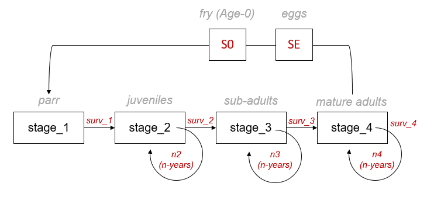{#07_life_cycle_model-07_life_cycle_model-07_life_cycle_model-07_life_cycle_model-07_life_cycle_model-07_life_cycle_model-07_life_cycle_model-fig-figure28}

The life cycle modelling component of the CEMPRA tool is set up as a pre-birth pulse census (see Caswell 2000). Since the design of stage-structured matrix models does not easily allow for the initial number of eggs and fry to be represented as independent matrix elements (cells), their transitions are included within the fecundity term. In a pre-birth pulse census, we assume that the demographic census takes place immediately before spawning (fecundity), meaning that yearlings of the previous spawning year have survived a full time-step (Age-0/stage-0 to Age-1/stage-1). Yearlings (Age-0: egg & fry) must survive the entire census period to the start of the next census. Therefore, the Age-0 transitions (egg-to-fry survivorship: SE and fry-to-parr survivorship: S0) are accounted for within the fecundity element (cells) of the transition matrix (Table 1).

### Anadromous Life Histories

| Parameter  | Name       | Value |
|------------|------------|-------|
| Anadromous | anadromous | TRUE  |

: Parameter in the life cycle parameters file to trigger the anadromous life history. To use the anadromous life history schedule you must add a row with the parameter name anadromous and then set the value to TRUE. If the anadromous parameter is not specified or missing/excluded from the life cycle parameters inputs file the CEMPRA toolbox will assume that the population is not anadromous.

For semelparous species (such as salmon) we need to impose a slightly different structure to accurately represent a terminal spawner class (B) with death upon reproduction. This can become challenging because we need to also account for the fact that some species such as Coho Salmon, Chinook Salmon, Steelhead etc. will choose to return to spawn at different ages. For example, some Chinook Salmon will return to spawn at age-3, age-4, or age-5 (and sometimes even later). Therefore, the matrix structure needs to represent a dual track for breeders (B) that return to spawn and pre-breeders (P) that remain at sea (or elsewhere) for continued growth. Elegant solutions have been proposed by [@davison2016] (and others) to achieve this.

The diagram below illustrates the anadromous life history diagram for Chinook Salmon. In this diagram, there are two pathways available to individual age-2 fish transitioning to age-3 fish. Individuals may return for spawning as breeders (B) (orange boxes) or remain in the marine environment as pre-breeders (Pb) (light blue boxes) for additional years. Pre-breeder (Pb) age classes can have interannual survivorship estimates \>0 (to advance fish to older age classes) but all spawner classes (B-breeders) will die after spawning. The probability of becoming a spawner (at age 3-5) will depend on the portion that become mature at each age class (mat_x). For example, the transition from age-2 (Pb - prebreeders) to age-3 spawners (B - breeders) will be expressed as the baseline marine survivorship from age-2 to age-3  (surv_2) multiplied by the portion of fish that spawn at age-3 (mat_3). Additional migratory mortality for age-3 fish returning to spawn can expressed as (smig_3). Alternatively, age-2 fish can remain at sea for another year to enter the age-3 pre-breeder marine class (stage_Pb_3). This marine transition (stage_Pb_2 to stage_Pb_3) will be expressed as the baseline age-2 to age-3 marine survivorship (surv_2) \* the portion of fish that do not spawn at age-3 (1 – mat_3). The cycle repeats itself until the final transition from age-4 to age-5. We assume that age-5 is the maximum possible age any fish can achieve. mat_5 is set 1.0 (100% of remaining individuals return to spawn). No fish will enter into the class (stage_Pb_5 – not shown). We can also set surv_5 to 0, but doing so is not necessary if mat_5 is set to 1.0.

Recruitment of one-year-old fish (stage_Pb_1) is a function of the number of spawners of a given age class (e.g., stage_B_x) multiplied by the average pre-spawn mortality of that age class (u_x), the average fecundity (eggs per female spawner, eps) for that age class (eps_x), the sex ratio (portion female, SR), the average egg survivorship (SE), and finally the average fry survivorship (S0). We can assume the spawning events (events) and interval (int) are both set to 1.0. Therefore, the number of stage_Pb_1 recruits from age-3 spawners would be expressed as (μ_3 \* events \* eps_3 \* SE \* s0 \* SR)/int.

This diagram can be restructured for Coho, Steelhead, Coastal Cutthroat etc. by adjusting vital rates and then adding or removing age class maturity schedules (see examples at the end of this chapter). We strongly recommend that all implementations of the CEMPRA anadromous life cycle model for salmon develop an age-based matrix model (Leslie Matrix Models) as a opposed to a stage-based matrix model. We have found that these are less prone to misinterpretations and easier to diagnose.

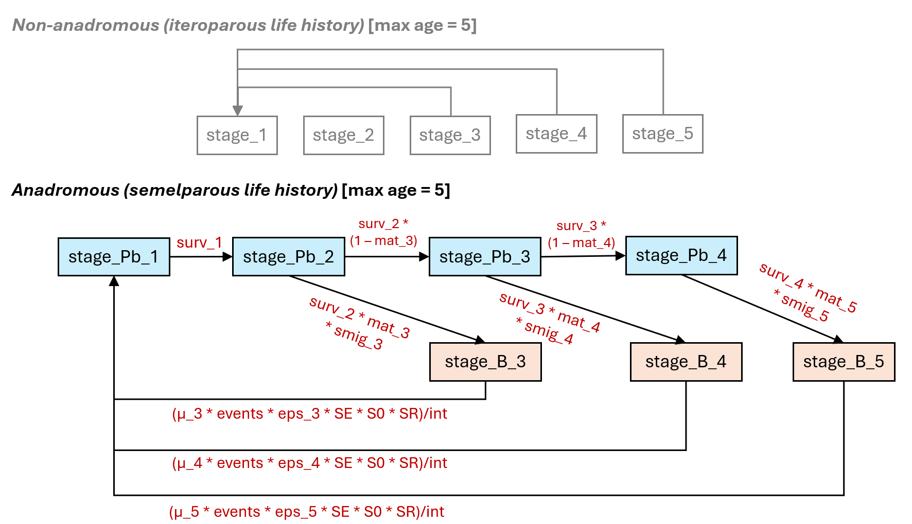{fig-alt="Generalized life history stage class transition diagram for anadromous species (example for Chinook Salmon)" fig-align="center"}

### Vital Rates for Survivorship and Growth

The CEMPRA tool's "pre-birth pulse" census assumes that the demographic census occurs just before spawning. This means that individuals counted as yearlings (from the previous spawning season) have already survived one full time-step—from birth (Age-0/Stage-0) to Age-1/Stage-1.

During the first year, two survival rates apply:

SE: Egg survivorship. S0: Sub-yearling (fry) survivorship. Their product (SE × S0) represents the overall early-life survival from egg to age-1. Note that there is no `surv_0` parameter in the life cycle profile — instead, `SE` and `S0` are specified separately and their combined effect is folded into the fecundity terms of the transition matrix.

Once individuals reach Age 1 (Stage 1), the parameter surv_1 governs the density-independent transition to Stage 2. For most anadromous species, which migrate to sea shortly after spawning, surv_1 should be calculated as the product of smolt survivorship and the survival rate during the first several months at sea (up to the individual’s second birthday). For species/life histories that reside in the freshwater environment for longer (e.g., Coho & stream-type Chinook), surv_1 can be adjusted to represent yearling/parr survivorship.

The following table lists the vital rates for survivorship and growth:

+-----------+------------------------------------------------------------------------------------------------------------------------------------------------------------------------------------------------------------------------------------------------------------------------------------------------------------------------------------------------------------------------------------------------------------------------------------------------------------------------------------------------------------------------------+
| Parameter | Description                                                                                                                                                                                                                                                                                                                                                                                                                                                                                                                  |
+===========+==============================================================================================================================================================================================================================================================================================================================================================================================================================================================================================================================+
| Nstage    | The number of stages in the transition matrix (excluding Stage-0/Age-0).                                                                                                                                                                                                                                                                                                                                                                                                                                                     |
|           |                                                                                                                                                                                                                                                                                                                                                                                                                                                                                                                              |
|           | For non-anadromous species: Each stage must span one or more years in the life cycle. In the reference example, there are four stages: stage_1, stage_2, stage_3, and stage_4.                                                                                                                                                                                                                                                                                                                                               |
|           |                                                                                                                                                                                                                                                                                                                                                                                                                                                                                                                              |
|           | For anadromous species, each year is one stage (age-based Leslie matrix). Set Nstage to the maximum age (e.g., 5 for Chinook spawning up to age 5). The model determines pre-breeder (Pb) stages from non-zero surv_X values and adds breeder (B) columns for each age with mat_X \> 0. Do not double-count spawning/non-spawning sub-classes. Example: surv_1–surv_4 \> 0 with mat_3, mat_4, mat_5 \> 0 produces a 7×7 matrix (4 Pb + 3 B). \|                                                                              |
+-----------+------------------------------------------------------------------------------------------------------------------------------------------------------------------------------------------------------------------------------------------------------------------------------------------------------------------------------------------------------------------------------------------------------------------------------------------------------------------------------------------------------------------------------+
| surv_1    | Mean annual survivorship for each stage transition (e.g., surv_1 is the survival probability for transitioning from stage 1 to stage 2; surv_2 is the survival from stage 2 to stage 3). \|                                                                                                                                                                                                                                                                                                                                  |
|           |                                                                                                                                                                                                                                                                                                                                                                                                                                                                                                                              |
| surv_2    | Create new rows in the life cycle parameter csv file so that surv_1, surv_2, surv_3, etc. extends to the Nstage.                                                                                                                                                                                                                                                                                                                                                                                                             |
|           |                                                                                                                                                                                                                                                                                                                                                                                                                                                                                                                              |
| surv_3    | Similarly, delete rows if Nstage is lower than the default csv file. These survivorship estimates should be estimates of intrinsic density-independent survival (in the absence of density-dependent constraints).                                                                                                                                                                                                                                                                                                           |
|           |                                                                                                                                                                                                                                                                                                                                                                                                                                                                                                                              |
| surv\_... |                                                                                                                                                                                                                                                                                                                                                                                                                                                                                                                              |
+-----------+------------------------------------------------------------------------------------------------------------------------------------------------------------------------------------------------------------------------------------------------------------------------------------------------------------------------------------------------------------------------------------------------------------------------------------------------------------------------------------------------------------------------------+
| year_1    | The number of years spent in each stage (e.g., year_2 is the number of years spent in stage class 2). Usually these values will all be 1 (one stage = one year). However, for non-anadromous species, individuals can spend more than one year in each stage. When year_X \> 1, the matrix splits survival into stage-staying vs stage-advancing probabilities. Setting all year values to 1 gives an age-based Leslie matrix. **For anadromous species, year_X should always be 1.** Add or remove rows to match Nstage. \| |
|           |                                                                                                                                                                                                                                                                                                                                                                                                                                                                                                                              |
| year_2    |                                                                                                                                                                                                                                                                                                                                                                                                                                                                                                                              |
|           |                                                                                                                                                                                                                                                                                                                                                                                                                                                                                                                              |
| year_3    |                                                                                                                                                                                                                                                                                                                                                                                                                                                                                                                              |
|           |                                                                                                                                                                                                                                                                                                                                                                                                                                                                                                                              |
| year\_... |                                                                                                                                                                                                                                                                                                                                                                                                                                                                                                                              |
+-----------+------------------------------------------------------------------------------------------------------------------------------------------------------------------------------------------------------------------------------------------------------------------------------------------------------------------------------------------------------------------------------------------------------------------------------------------------------------------------------------------------------------------------------+
| SE        | Egg survivorship (density-independent).                                                                                                                                                                                                                                                                                                                                                                                                                                                                                      |
+-----------+------------------------------------------------------------------------------------------------------------------------------------------------------------------------------------------------------------------------------------------------------------------------------------------------------------------------------------------------------------------------------------------------------------------------------------------------------------------------------------------------------------------------------+
| S0        | Age-0 fry or sub-yearling survivorship (density-independent).                                                                                                                                                                                                                                                                                                                                                                                                                                                                |
+-----------+------------------------------------------------------------------------------------------------------------------------------------------------------------------------------------------------------------------------------------------------------------------------------------------------------------------------------------------------------------------------------------------------------------------------------------------------------------------------------------------------------------------------------+

*Table: Vital rates for survivorship and growth in the life cycle model.*

Ensure that all survivorship estimates represent hypothetical density-independent survivorship in the absence of density-dependent constraints. Density-dependent survivorship is accounted for in the next section. If density-independent survivorship is unknown, but strong, density-dependent constraints are to be included in the species profile, then it might be possible to simply set the density-independent survivorship estimate to a value close to 1.0 (e.g., S0: 0.999).

For fecundity, we have to consider the proportion of each age class that is sexually mature (mat), the proportion of the population that is female (SR: 0.5), the fecundity (eps: eggs per spawner) per spawning event, the spawning events per year (events), and the spawning interval (int). The calculation of individuals in stage class 1 (stage_1) also must account for the Age-0 survivorship of eggs and fry.

*Sample fecundity function for stage class 4:*

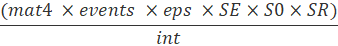

### Vital Rates for Fecundity

The following table lists the vital rates for fecundity:

+--------------------------------------------------------+---------------------------------------------------------------------------------------------------------------------------------------------------------------------------------------------------------------------------------------------------------------------------------------------------------------------------------------------------------------------------------------------------------------------------------------------------------------------------------------------------------------------------------------------------------------------------------------------------+
| Parameter                                              | Description                                                                                                                                                                                                                                                                                                                                                                                                                                                                                                                                                                                       |
+========================================================+===================================================================================================================================================================================================================================================================================================================================================================================================================================================================================================================================================================================================+
| mat_1                                                  | The proportion of each stage class that is sexually mature (0 -- 1). For example, in the demo species profile, 100% of the individuals become sexually mature at stage class 4, and the sexual maturity is 0% for all other stage classes. It is also possible for a stage class to have partial maturity (e.g., 0.85). If the Nstage value is different than four, then add or remove rows in the species profile so that the number of mat values matches the number of stage classes (Nstage value).                                                                                           |
|                                                        |                                                                                                                                                                                                                                                                                                                                                                                                                                                                                                                                                                                                   |
| mat_2                                                  | Anadromous simulations: For some anadromous species such as Chinook salmon, individuals will generally return to spawn between age-3 and age-6. Different populations will have different maturity schedules (e.g., 15% age-3, 70% age-4, 100% age-5 etc.). These values do not need to sum to 100% but age-specific maturity is simply the probability that an individual will become sexually mature and return to spawn at a given age. For anadromous species the oldest age class should have a maturity of 100%, meaning that 100% of individuals at that age class will be ready to spawn. |
|                                                        |                                                                                                                                                                                                                                                                                                                                                                                                                                                                                                                                                                                                   |
| mat_3                                                  |                                                                                                                                                                                                                                                                                                                                                                                                                                                                                                                                                                                                   |
|                                                        |                                                                                                                                                                                                                                                                                                                                                                                                                                                                                                                                                                                                   |
| mat\_...                                               |                                                                                                                                                                                                                                                                                                                                                                                                                                                                                                                                                                                                   |
|                                                        |                                                                                                                                                                                                                                                                                                                                                                                                                                                                                                                                                                                                   |
| (1 to Nstage)                                          |                                                                                                                                                                                                                                                                                                                                                                                                                                                                                                                                                                                                   |
+--------------------------------------------------------+---------------------------------------------------------------------------------------------------------------------------------------------------------------------------------------------------------------------------------------------------------------------------------------------------------------------------------------------------------------------------------------------------------------------------------------------------------------------------------------------------------------------------------------------------------------------------------------------------+
| events                                                 | Spawning events per female per year. This parameter will almost always be set to 1 for most species to indicate one spawning event per year per mature female. Even for populations with complex life history variants (e.g., systems with both Spring Chinook & Fall Chinook), we still recommend keeping this value at one and using two different species profiles to represent each life history variant.                                                                                                                                                                                     |
+--------------------------------------------------------+---------------------------------------------------------------------------------------------------------------------------------------------------------------------------------------------------------------------------------------------------------------------------------------------------------------------------------------------------------------------------------------------------------------------------------------------------------------------------------------------------------------------------------------------------------------------------------------------------+
| [*Fixed Fecundity:*]{.underline}                       | Eggs per spawning female (eps). The mean fecundity per female per spawning event.                                                                                                                                                                                                                                                                                                                                                                                                                                                                                                                 |
|                                                        |                                                                                                                                                                                                                                                                                                                                                                                                                                                                                                                                                                                                   |
| eps                                                    | Anadromous simulations: For most species we can simply enter an estimate of the mean eggs per female spawner as a fixed global value (e.g., 500 eggs/spawner). However, for some species we may wish to enter in a separate fecundity value for each stage/age class (e.g., Age-3 spawners, eps_3: 3,700; Age-4 spawners, 4,200 eggs/spawner; Age-5 spawners, 5,000 eggs/spawner).                                                                                                                                                                                                                |
|                                                        |                                                                                                                                                                                                                                                                                                                                                                                                                                                                                                                                                                                                   |
| [*Stage-specific Fecundity (anadromous):*]{.underline} | If you choose to enter in age/stage-specific fecundity estimates please delete the row for 'eps'. If you choose to enter in a fixed global fecundity then delete the age-specific fecundity estimates. Currently age-specific fecundities only works for anadromous simulations.                                                                                                                                                                                                                                                                                                                  |
|                                                        |                                                                                                                                                                                                                                                                                                                                                                                                                                                                                                                                                                                                   |
| eps_3                                                  |                                                                                                                                                                                                                                                                                                                                                                                                                                                                                                                                                                                                   |
|                                                        |                                                                                                                                                                                                                                                                                                                                                                                                                                                                                                                                                                                                   |
| eps_4                                                  |                                                                                                                                                                                                                                                                                                                                                                                                                                                                                                                                                                                                   |
|                                                        |                                                                                                                                                                                                                                                                                                                                                                                                                                                                                                                                                                                                   |
| eps_5                                                  |                                                                                                                                                                                                                                                                                                                                                                                                                                                                                                                                                                                                   |
|                                                        |                                                                                                                                                                                                                                                                                                                                                                                                                                                                                                                                                                                                   |
| eps\_...                                               |                                                                                                                                                                                                                                                                                                                                                                                                                                                                                                                                                                                                   |
+--------------------------------------------------------+---------------------------------------------------------------------------------------------------------------------------------------------------------------------------------------------------------------------------------------------------------------------------------------------------------------------------------------------------------------------------------------------------------------------------------------------------------------------------------------------------------------------------------------------------------------------------------------------------+
| SR                                                     | The sex ratio is represented as the proportion of the population that is female. This value will almost always be set to 0.5 to indicate an equal proportion of males and females in the population.                                                                                                                                                                                                                                                                                                                                                                                              |
+--------------------------------------------------------+---------------------------------------------------------------------------------------------------------------------------------------------------------------------------------------------------------------------------------------------------------------------------------------------------------------------------------------------------------------------------------------------------------------------------------------------------------------------------------------------------------------------------------------------------------------------------------------------------+
| int                                                    | Spawning interval (in years). This value will also be set to 1 for most species, indicating that mature individuals spawn each year. *Proceed with caution if you choose to use a value other than 1 for this input (see details in formulas)*.                                                                                                                                                                                                                                                                                                                                                   |
+--------------------------------------------------------+---------------------------------------------------------------------------------------------------------------------------------------------------------------------------------------------------------------------------------------------------------------------------------------------------------------------------------------------------------------------------------------------------------------------------------------------------------------------------------------------------------------------------------------------------------------------------------------------------+
| smig_3                                                 | (Spawner migration Survivorship Rates: Anadromous simulations only)                                                                                                                                                                                                                                                                                                                                                                                                                                                                                                                               |
|                                                        |                                                                                                                                                                                                                                                                                                                                                                                                                                                                                                                                                                                                   |
| smig_4                                                 | Spawner migration survivorship rates for each age class. For example, smig_4 is migratory survivorship for age-4 spawners. These parameters act as a survivorship multiplier. If the spawner migration mortality is 10% then smig_4 should be input as 0.9 (1 - 0.1). These values can be set to 1.0 for initial model setup. Similar to other input parameters check the Nstage value and add or remove rows so that smig_3, smig_4, smig_5 entries are present for each of the mature age classes (anywhere where mat_x is set and is greater than zero).                                       |
|                                                        |                                                                                                                                                                                                                                                                                                                                                                                                                                                                                                                                                                                                   |
| smig_5                                                 |                                                                                                                                                                                                                                                                                                                                                                                                                                                                                                                                                                                                   |
|                                                        |                                                                                                                                                                                                                                                                                                                                                                                                                                                                                                                                                                                                   |
| ...                                                    |                                                                                                                                                                                                                                                                                                                                                                                                                                                                                                                                                                                                   |
+--------------------------------------------------------+---------------------------------------------------------------------------------------------------------------------------------------------------------------------------------------------------------------------------------------------------------------------------------------------------------------------------------------------------------------------------------------------------------------------------------------------------------------------------------------------------------------------------------------------------------------------------------------------------+
| u_3                                                    | (Prespawn Survivorship Rates: Anadromous simulations only)                                                                                                                                                                                                                                                                                                                                                                                                                                                                                                                                        |
|                                                        |                                                                                                                                                                                                                                                                                                                                                                                                                                                                                                                                                                                                   |
| u_4                                                    | Prespawn survivorship rates for each age class. For example u_4 is pre-spawn survivorship for age-4 spawners. These parameters act as a survivorship multiplier. If the prespawn mortality is 10% then u_4 (prespawn survivorship) should be input as 0.9 (1 - 0.1). These values can be set to 1.0 for initial model setup. Similar to other input parameters check the Nstage value and add or remove rows so that u_3, u_4, u_5 entries are present for each of the mature age classes (anywhere where mat_x is set and is greater than zero).                                                 |
|                                                        |                                                                                                                                                                                                                                                                                                                                                                                                                                                                                                                                                                                                   |
| u_5                                                    |                                                                                                                                                                                                                                                                                                                                                                                                                                                                                                                                                                                                   |
|                                                        |                                                                                                                                                                                                                                                                                                                                                                                                                                                                                                                                                                                                   |
| u\_...                                                 |                                                                                                                                                                                                                                                                                                                                                                                                                                                                                                                                                                                                   |
+--------------------------------------------------------+---------------------------------------------------------------------------------------------------------------------------------------------------------------------------------------------------------------------------------------------------------------------------------------------------------------------------------------------------------------------------------------------------------------------------------------------------------------------------------------------------------------------------------------------------------------------------------------------------+

*Table: Vital rates for fecundity in the life cycle model.*

## Matrix Representations

### Iteroparous (Non-anadromous) Species

We can combine all parameters discussed in this section along with the example species profile to construct a symbolic (mathematical) representation of the transition matrix (Table 1). The stage-to-stage transitions account for the probability of staying within each stage or advancing to the next stage based on the `surv_X` and n-year spent within a stage `year_X`. The fecundity element of the matrix (top row) includes elements for fecundity and Age-0 survivorship.

::: {#07_life_cycle_model-07_life_cycle_model-07_life_cycle_model-07_life_cycle_model-07_life_cycle_model-tbl:transition-matrix}
Table 1. Symbolic Representation of the Transition Matrix for non-anadromous species

+-----------------------+---------------------------------------------------------------------+----------------------------------------------------------------------+-------------------------------------------------------------------------------------------------------------------------------------+-----------------------------------------------+---------+
| ============= stage_1 | # stage_1                                                           | # stage_2                                                            | # stage_3                                                                                                                           | # stage_4                                     |         |
|                       |                                                                     |                                                                      |                                                                                                                                     |                                               |         |
|                       | surv_1 \* (1 - surv_1\^( year_1 - 1))/(1 - surv_1\^ year_1)         | (mat2 \* events \* eps \* sE \* s0 \* sR)/int                        | (mat3 \* events \* eps \* sE \* s0 \* sR)/int                                                                                       | (mat4 \* events \* eps \* sE \* s0 \* sR)/int |         |
+-----------------------+---------------------------------------------------------------------+----------------------------------------------------------------------+-------------------------------------------------------------------------------------------------------------------------------------+-----------------------------------------------+---------+
|                       |                                                                     |                                                                      |                                                                                                                                     |                                               |         |
+-----------------------+---------------------------------------------------------------------+----------------------------------------------------------------------+-------------------------------------------------------------------------------------------------------------------------------------+-----------------------------------------------+---------+
| stage_2               | surv_1 - surv_1 \* (1 - surv_1\^(year_1 - 1))/(1 - surv_1\^ year_1) | surv_2 \* (1 - surv_2\^( year_2 - 1))/(1 - surv_2\^ year_2)          | 0                                                                                                                                   | 0                                             |         |
+-----------------------+---------------------------------------------------------------------+----------------------------------------------------------------------+-------------------------------------------------------------------------------------------------------------------------------------+-----------------------------------------------+---------+
| stage_3               | 0                                                                   | surv_2 - surv_2 \* (1 - surv_2\^( year_2 - 1))/(1 - surv_2\^ year_2) | surv_3 \* (1 - surv_3\^( year_3 - 1))/(1 - surv_3\^ year_3)                                                                         | 0                                             |         |
+-----------------------+---------------------------------------------------------------------+----------------------------------------------------------------------+-------------------------------------------------------------------------------------------------------------------------------------+-----------------------------------------------+---------+
| stage_4               | 0                                                                   | 0                                                                    | surv_3 - surv_3 \* (1 - surv_3\^( year_3 - 1))/(1 - surv_3\^ year_3) \| surv_4 \* (1 - surv_4\^( year_4 - 1))/(1 - surv_4\^ year_4) |                                               |         |
+-----------------------+---------------------------------------------------------------------+----------------------------------------------------------------------+-------------------------------------------------------------------------------------------------------------------------------------+-----------------------------------------------+---------+
:::

**Reading the matrix — a guide for new users**

The matrix has three structural zones:

-   **Top row (fecundity)**: Only columns corresponding to mature stages have non-zero entries. These convert mature individuals back into new stage-1 recruits, incorporating egg survival (`sE`), fry survival (`s0`), sex ratio (`sR`), maturity (`mat_X`), fecundity (`eps`), and spawning parameters. Columns for immature stages are zero because those stages do not reproduce.
-   **Diagonal (stage-staying)**: The probability that an individual survives and remains in the same stage for another year. This is only non-zero when `year_X > 1` (i.e., the stage spans multiple years). The formula `surv_X * (1 - surv_X^(year_X - 1)) / (1 - surv_X^year_X)` calculates the staying probability. If `year_X = 1`, the diagonal is zero and all survivors advance.
-   **Sub-diagonal (stage-advancing)**: The probability that an individual survives and advances to the next stage. Calculated as the complement: `surv_X - (staying probability)`. The staying and advancing probabilities always sum to exactly `surv_X`.

**Do individuals spend more than one year in each stage?**

The stage-to-stage transition probabilities are expressed as functions of `surv_X` (annual survivorship within stage X) and `year_X` (number of simulation years within stage X). `surv_X` is the total annual probability of survival (i.e., regardless of staying within the current stage OR advancing to the next subsequent stage). The example below illustrates how the combined probability of staying within a stage or advancing to the next stage always equals `surv_X` regardless of n-years in each stage. *Note that the sum of the yellow cells equals 0.6 (for both fates of staying within stage or advancing to the next stage).*

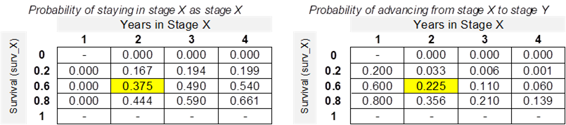

We can continue with the working example to represent the transition matrix numerically (Table 2). The fecundity element for `stage_4` is set at 45 since it accounts for the vital rates relating to maturity and Age-0 survivorship.

Net Fecundity (stage-4) = (mat4 \* events \* eps \* sE \* s0 \* sR)/int

45 = (1 \* 1 \* 3,000 \* 0.1 \* 0.3 \* 0.5)/1

::: {#07_life_cycle_model-07_life_cycle_model-07_life_cycle_model-07_life_cycle_model-07_life_cycle_model-tbl:numerical-transition-matrix}
Table 2. Numerical representation of the transition matrix

|         | stage_1 | stage_2 | stage_3 | stage_4 |
|---------|---------|---------|---------|---------|
| stage_1 | 0       | 0       | 0       | 45      |
| stage_2 | 0.3     | 0.231   | 0       | 0       |
| stage_3 | 0       | 0.069   | 0.474   | 0       |
| stage_4 | 0       | 0       | 0.426   | 0.756   |
:::

The derived lambda value of the projection matrix (intrinsic rate of growth) in this example species profile is 1.21 (above 1.0), meaning that the population will continue to grow exponentially in the absence of density-dependent constraints.

### Semelparous Species ('anadromous' Model Runs)

For anadromous (semelparous) species such as Pacific salmon, the matrix structure differs from iteroparous species. Because individuals die after spawning, the matrix must distinguish between non-spawning **pre-breeder (Pb)** stages and terminal **breeder (B)** stages. Each spawning age class appears as a separate breeder column rather than being folded into a single adult stage with maturity probabilities. The example below illustrates a Chinook Salmon population that can spawn at ages 3, 4, or 5 (i.e., after 2, 3, or 4 years of freshwater and ocean rearing as pre-breeders).

**Symbolic Representation of the Transition Matrix (B) — Chinook Salmon (spawning ages 3–5)**

+----------------+------------+---------------------+---------------------+---------------------+------------------------------------------------+------------------------------------------------+------------------------------------------------+
|                | Stage Pb 1 | Stage Pb 2          | Stage Pb 3          | Stage Pb 4          | Stage B 3                                      | Stage B 4                                      | Stage B 5                                      |
+================+============+=====================+=====================+=====================+================================================+================================================+================================================+
| **Stage Pb 1** | 0          | 0                   | 0                   | 0                   | (u3 \* events \* eps3 \* sE \* s0 \* sR) / int | (u4 \* events \* eps4 \* sE \* s0 \* sR) / int | (u5 \* events \* eps5 \* sE \* s0 \* sR) / int |
+----------------+------------+---------------------+---------------------+---------------------+------------------------------------------------+------------------------------------------------+------------------------------------------------+
| **Stage Pb 2** | s1         | 0                   | 0                   | 0                   | 0                                              | 0                                              | 0                                              |
+----------------+------------+---------------------+---------------------+---------------------+------------------------------------------------+------------------------------------------------+------------------------------------------------+
| **Stage Pb 3** | 0          | s2 \* (1 - mat3)    | 0                   | 0                   | 0                                              | 0                                              | 0                                              |
+----------------+------------+---------------------+---------------------+---------------------+------------------------------------------------+------------------------------------------------+------------------------------------------------+
| **Stage Pb 4** | 0          | 0                   | s3 \* (1 - mat4)    | 0                   | 0                                              | 0                                              | 0                                              |
+----------------+------------+---------------------+---------------------+---------------------+------------------------------------------------+------------------------------------------------+------------------------------------------------+
| **Stage B 3**  | 0          | s2 \* mat3 \* smig3 | 0                   | 0                   | 0                                              | 0                                              | 0                                              |
+----------------+------------+---------------------+---------------------+---------------------+------------------------------------------------+------------------------------------------------+------------------------------------------------+
| **Stage B 4**  | 0          | 0                   | s3 \* mat4 \* smig4 | 0                   | 0                                              | 0                                              | 0                                              |
+----------------+------------+---------------------+---------------------+---------------------+------------------------------------------------+------------------------------------------------+------------------------------------------------+
| **Stage B 5**  | 0          | 0                   | 0                   | s4 \* mat5 \* smig5 | 0                                              | 0                                              | 0                                              |
+----------------+------------+---------------------+---------------------+---------------------+------------------------------------------------+------------------------------------------------+------------------------------------------------+

: Symbolic transition matrix for an anadromous Chinook Salmon population with spawning at ages 3, 4, and 5. Pb = pre-breeder (non-spawning); B = breeder (spawning). {.striped}

**Key structural differences from the non-anadromous matrix:**

-   **No diagonal entries**: Because anadromous species use age-based (Leslie) matrices with `year_X = 1`, there is no stage-staying — every individual either advances or dies. All diagonal entries are zero.
-   **No B-to-B or B-to-Pb transitions**: Breeder stages are terminal. All entries in the B columns (except the fecundity row) are zero because spawners die after reproduction.
-   **Maturity split**: At ages where spawning is possible, the sub-diagonal splits into two rows — one for pre-breeders (non-maturing) and one for breeders (maturing and migrating). This is unique to the anadromous matrix.
-   **Fecundity only from B columns**: Only breeder (B) stages produce offspring. The Pb columns of the fecundity row are zero.

**Understanding the fecundity row (top row)**

The top row of the matrix converts spawners back into new stage-1 recruits. For example, the entry for Stage B 4 is:

(u4 \* events \* eps4 \* sE \* s0 \* sR) / int

This reads as: prespawn survival for age-4 spawners (`u4` — the fraction that survive to actually spawn after arriving on the spawning grounds), multiplied by the number of spawning events per female (`events`), multiplied by eggs per age-4 female (`eps4`), multiplied by egg survival (`sE`), multiplied by fry survival to first August (`s0`), multiplied by the sex ratio / proportion female (`sR`), divided by the spawning interval (`int`). The result is the number of new **stage-1 recruits** (not eggs, not fry) produced per age-4 spawner. This is because the pre-birth-pulse census counts individuals only after they have survived the egg and fry stages.

**Understanding the maturity split (pre-breeder vs breeder)**

At each age where spawning is possible, the matrix splits the surviving population into two fates. Consider a stage-2 (age-2) fish. If `mat3 = 0.3` (30% of age-3 fish mature), then:

-   **Stage Pb 3** receives `s2 * (1 - mat3)` = the fraction that survives and remains as a non-spawning pre-breeder (70% of survivors continue rearing).
-   **Stage B 3** receives `s2 * mat3 * smig3` = the fraction that survives, matures, and successfully migrates to spawn (`smig3` is the migration survival probability for age-3 spawners).

Together, these two entries partition all surviving stage-2 fish into one of two fates. Note that if `smig3 < 1.0` (i.e., some fish die during migration), the two terms will not perfectly sum to `s2` — the difference represents migration mortality for maturing fish.

**Eggs and fry are embedded in the fecundity formula**

Unlike some matrix formulations, eggs and fry do not appear as separate rows or columns in the anadromous transition matrix. The egg stage (governed by `sE`) and the fry stage (governed by `s0`) are folded into the top-row fecundity terms `(uX * events * epsX * sE * s0 * sR) / int`. This means the matrix directly projects from spawners to stage-1 recruits in a single step. Density-dependent constraints on eggs or fry (e.g., `bh_stage_0`, `hs_stage_0`) are applied *outside* the matrix projection as a separate post-projection adjustment (see the Density-Dependent Constraints section below).

## Stochastic Simulations

Several additional parameters are available to influence the stochasticity (variability) of the population projections. Implementing these parameters is useful for understanding the viability of the population and (over many simulations) estimating the number of batch replicates that fall below a given critical threshold (e.g., X adults).

### eps_sd: Standard Deviation in Eggs-per-Spawner

+-----------+-------------------------------------------------------------------------------------------------------------------------------------------------------------------------------------------------------------------------------------------------------------------------------------------------------------------------------------------------------------------------------------------------------------------+
| Parameter | Description                                                                                                                                                                                                                                                                                                                                                                                                       |
+===========+===================================================================================================================================================================================================================================================================================================================================================================================================================+
| `eps_sd`  | The Standard Deviation in Eggs-per-Spawner controls the variability in fecundity across simulation years and batch replicates. The example below shows a sample projection with `eps_sd` set to 250 and 750. In the example with `eps_sd` set to 750, there are several years with very high fecundity. Density-dependent constraints (if implemented) may attenuate the apparent effect of high `eps_sd` inputs. |
+-----------+-------------------------------------------------------------------------------------------------------------------------------------------------------------------------------------------------------------------------------------------------------------------------------------------------------------------------------------------------------------------------------------------------------------------+

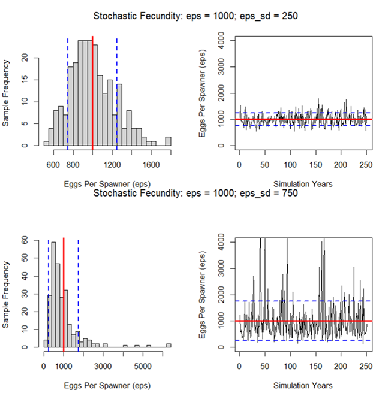{#07_life_cycle_model-07_life_cycle_model-07_life_cycle_model-07_life_cycle_model-07_life_cycle_model-fig-eps-sd}

<div>

eps_sd Standard Deviation in Eggs-per-Spawner

</div>

### egg_rho: Correlation in Egg Fecundity Through Time

+-----------+------------------------------------------------------------------------------------------------------------------------------------------------------------------------------------------------------------------------------------------------------------------------------------------------------------------------------------------------------------------------------------------------------------------------------------------------------------------------------------------------------------------------------------------------------------------------------------------------------------------------------------------------------------------------------------------------------------------------------------------------------------------------------------------------------------------------------+
| Parameter | Description                                                                                                                                                                                                                                                                                                                                                                                                                                                                                                                                                                                                                                                                                                                                                                                                                  |
+===========+==============================================================================================================================================================================================================================================================================================================================================================================================================================================================================================================================================================================================================================================================================================================================================================================================================================+
| `egg_rho` | In natural populations, there will be good years and bad years. It's assumed that good years will be good for large adults and small adults. If multiple mature stage classes contribute to spawning (fecundity) (i.e., maturity values are greater than 0), it is assumed that fecundity will be correlated between good and bad years across stage classes (i.e., stage_5, stage_6 & stage_7). `egg_rho` controls the degree of correlation in interannual fecundity between stage classes. See the following figure for an illustrative example. If `egg_rho` is low, and multiple stage classes contribute to spawning, then some stage classes may compensate for good/bad years. Conversely, if `egg_rho` is high, then the population may be highly volatile as all cohorts experience good/bad years simultaneously. |
+-----------+------------------------------------------------------------------------------------------------------------------------------------------------------------------------------------------------------------------------------------------------------------------------------------------------------------------------------------------------------------------------------------------------------------------------------------------------------------------------------------------------------------------------------------------------------------------------------------------------------------------------------------------------------------------------------------------------------------------------------------------------------------------------------------------------------------------------------+

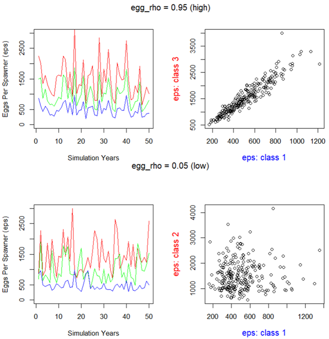{#07_life_cycle_model-07_life_cycle_model-07_life_cycle_model-07_life_cycle_model-07_life_cycle_model-fig-egg-rho}

<div>

egg_rho: correlation in egg fecundity through time

</div>

### M.cv: Coefficient of Variation (CV) in Interannual Stage-Specific Mortality

+-----------+------------------------------------------------------------------------------------------------------------------------------------------------------------------------------------------------------------------------------------------------------------------------------------------------+
| Parameter | Description                                                                                                                                                                                                                                                                                    |
+===========+================================================================================================================================================================================================================================================================================================+
| `M.cv`    | The Coefficient of Variation (CV) in stage-specific mortality (`M.cv`) is based on a beta distribution. This parameter allows for the modeling of variability in mortality rates across different life stages, contributing to a more dynamic and realistic simulation of population dynamics. |
+-----------+------------------------------------------------------------------------------------------------------------------------------------------------------------------------------------------------------------------------------------------------------------------------------------------------+

### M.rho: Correlation in Stage-Class Mortality Through Time

+-----------+---------------------------------------------------------------------------------------------------------------------------------------------------------------------------------------------------------------------------------------------------------------------------------------------------------------------------------------------------------------------------------------------------------------------------------------------------------------------------------------------------------------------------------------------------------------------------------------------------------------------+
| Parameter | Description                                                                                                                                                                                                                                                                                                                                                                                                                                                                                                                                                                                                         |
+===========+=====================================================================================================================================================================================================================================================================================================================================================================================================================================================================================================================================================================================================================+
| `M.rho`   | `M.rho`, the correlation in mortality through time, plays a critical role in modeling the variability of survivorship across life stages. In natural populations, the occurrence of good and bad years is often correlated across all stage classes, excluding eggs (`SE`). `M.rho` determines the degree of this correlation. A low `M.rho` value suggests that certain stage classes may compensate for good/bad years based on random sampling of survivorship, while a high `M.rho` implies that all cohorts may experience good/bad years simultaneously, leading to higher volatility in population dynamics. |
+-----------+---------------------------------------------------------------------------------------------------------------------------------------------------------------------------------------------------------------------------------------------------------------------------------------------------------------------------------------------------------------------------------------------------------------------------------------------------------------------------------------------------------------------------------------------------------------------------------------------------------------------+

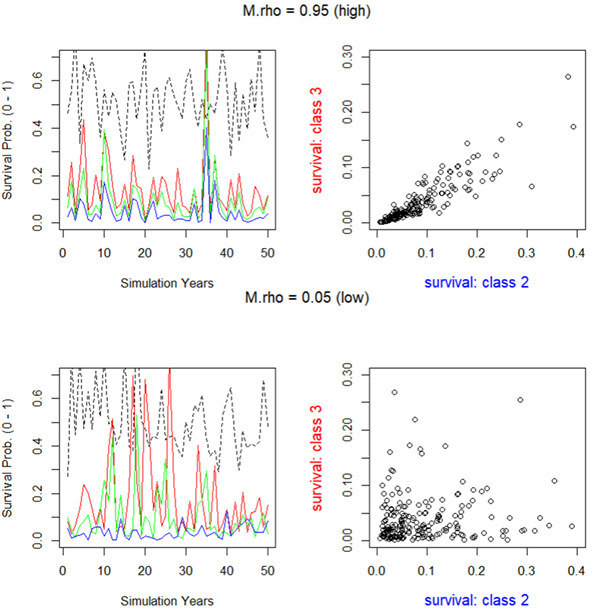{#07_life_cycle_model-07_life_cycle_model-07_life_cycle_model-07_life_cycle_model-07_life_cycle_model-fig-m-rho}

<div>

M.rho: correlation in survivorship through time

</div>

### p.cat: Probability of Catastrophe per Generation

+-----------+----------------------------------------------------------------------------------------------------------------------------------------------------------------------------------------------------------------------------------------------------------------------------------------------------------------------------------------------------------------------------+
| Parameter | Description                                                                                                                                                                                                                                                                                                                                                                |
+===========+============================================================================================================================================================================================================================================================================================================================================================================+
| p.cat     | `p.cat` represents the Probability of Catastrophe per Generation. This parameter is scaled to the average generation time of the population, reflecting the annual probability of a catastrophic event occurring. It's a critical factor in assessing the resilience and long-term sustainability of a population under varying environmental and anthropogenic pressures. |
+-----------+----------------------------------------------------------------------------------------------------------------------------------------------------------------------------------------------------------------------------------------------------------------------------------------------------------------------------------------------------------------------------+

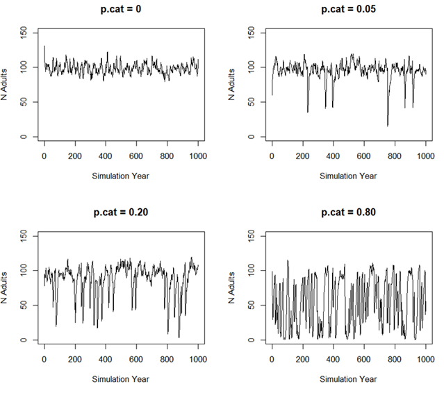{#07_life_cycle_model-07_life_cycle_model-07_life_cycle_model-07_life_cycle_model-07_life_cycle_model-fig-p-cat}

<div>

p.cat: Probability of Catastrophe per Generation

</div>

## Density-Dependent Constraints on Growth

It is rare for natural populations to grow in perpetuity without any constraints on growth, survival, and reproduction. Therefore, life cycle models will typically include a mechanism (or multiple mechanisms) to constrain population growth or limit high densities. We refer to these as density-dependent bottlenecks on population growth.

Stressor-response relationships can be incorporated into the life cycle model without accounting for density-dependent constraints, but the interpretation of the results will be limited to eigen analyses of intrinsic growth rates and sensitivities/elasticities assessments (e.g., comparing lambda values & productivity). While useful, these outputs are sometimes difficult to communicate to diverse working groups, and they may also be misleading, especially if habitat is limited. If there are key demographic bottlenecks in the life cycle, then a density-independent model may inappropriately lead users to focus on stressors linked to fecundity or early life-stage survivorship before a key bottleneck (e.g., egg-to-fry survivorship) is experienced. However, if (in reality) a population experiences strong density-dependent constraints on growth, then factors limiting habitat availability or productivity of a key life stage will become more influential. A common example of density-independent and density-dependent constraints on growth can be found in the transition between the early life stages of Steelhead (*Oncorhynchus mykiss*) as individuals transition from egg-to-fry (a density-independent life stage) and then from fry-to-smolts/parr (a density-dependent life stage) [@ward1993egg].

The life cycle modeling component of the CEMPRA tool has two (optional) mechanisms to incorporate density-dependent growth constraints. The primary mechanism considers stage and location-specific carrying capacities while a second (optional) mechanism considers adult carrying capacity and compensation ratios. In most cases incorporating density-dependent constraints with stage and location-specific carrying capacities can provide a more intuitive workflow; however, some individuals well-versed in Population Ecology may also be able to leverage compensation ratios.

*We strongly recommend starting with life stage-specific density dependent bottlenecks (e.g., a location is expected to support up to X fry, Y parr, and Z spawners based on habitat availability). Avoid the use of compensation ratios unless you are already familiar with their application in population ecology (most users will tend to find working with compensation ratios a little bit more advanced and sometimes non-intuitive).*

Both mechanisms of density-dependent constraints utilize the Beverton-Holt (BH) function or a strict "hockey stick" (HS) style fixed thresholds to limit population growth at key demographic bottlenecks. The Beverton-Holt function is an asymptotic recruitment curve that calculates the expected number of individuals entering the next stage as a function of the number of individuals in the current stage. In the case of stage-structured matrix models, this relationship constrains the number of individuals transitioning between two stages (e.g., from fry to stage 1, or from stage 2 to stage 3). The BH function takes three input parameters: an estimate of stage-specific carrying capacity (K) for the destination stage, a baseline estimate of density-independent survival (alpha = surv_X from the species profile) as the transition rate, and the number of individuals in the source stage class (Nt) for the simulation year. The BH equation is: `(alpha * Nt) / (1 + (alpha / K) * Nt)`. At low Nt, nearly all individuals survive (up to alpha \* Nt, e.g., 0.8 \* 100 = 80); However, at high Nt, output saturates toward K. The hockey-stick method is simpler: if the number of individuals in a stage exceeds K, the population is truncated to K.

The following interactive figure provides an overview of the Beverton-Holt function, showing the number of individuals at time *t* (Nt) on the x-axis and the number of individuals at time *t+1* (Nt+1) on the y-axis. For example, this could be the number of Age-0 fry on the x-axis and the number of Age-1+ parr recruits on the y-axis. The curved black line shows the effects of density-dependent growth (limited recruitment as the number of individuals in the source stage is increased). The steep red dashed line is the density-independent (DI) abundance where Nt+1 = alpha × Nt. The blue dotted line is the carrying capacity K. The "hockey stick" style density-dependent method simply applies the horizontal blue dotted line as a fixed threshold that cannot be exceeded. Use the sliders to explore how changing K and alpha (productivity/survival) affects the shape of the BH curve.

```{ojs}
//| echo: false

viewof K_bh = Inputs.range([10, 500], {value: 100, step: 10, label: "K (carrying capacity)"})
viewof alpha_bh = Inputs.range([0.05, 1.0], {value: 0.8, step: 0.05, label: "α (survival / productivity)"})
```

```{ojs}
//| echo: false

{
  const width = 600;
  const height = 420;
  const margin = {top: 20, right: 30, bottom: 50, left: 60};
  const pw = width - margin.left - margin.right;
  const ph = height - margin.top - margin.bottom;

  // X range: 0 to 4*K so the asymptote is clearly visible
  const xMax = Math.max(K_bh * 4, 200);
  const yMax = K_bh * 1.6;
  const nPts = 200;

  // Generate data
  const xs = Array.from({length: nPts + 1}, (_, i) => (i / nPts) * xMax);
  const bhData = xs.map(nt => ({
    nt,
    bh: (alpha_bh * nt) / (1 + (alpha_bh / K_bh) * nt),
    di: alpha_bh * nt
  }));

  const svg = d3.create("svg")
    .attr("viewBox", [0, 0, width, height])
    .attr("width", width)
    .attr("height", height)
    .style("font-family", "sans-serif");

  const g = svg.append("g")
    .attr("transform", `translate(${margin.left},${margin.top})`);

  // Scales
  const x = d3.scaleLinear().domain([0, xMax]).range([0, pw]);
  const y = d3.scaleLinear().domain([0, yMax]).range([ph, 0]);

  // Axes
  g.append("g")
    .attr("transform", `translate(0,${ph})`)
    .call(d3.axisBottom(x).ticks(8))
    .append("text")
    .attr("x", pw / 2)
    .attr("y", 40)
    .attr("fill", "black")
    .attr("text-anchor", "middle")
    .attr("font-size", "13px")
    .text("Nt (source stage abundance)");

  g.append("g")
    .call(d3.axisLeft(y).ticks(8))
    .append("text")
    .attr("transform", "rotate(-90)")
    .attr("x", -ph / 2)
    .attr("y", -45)
    .attr("fill", "black")
    .attr("text-anchor", "middle")
    .attr("font-size", "13px")
    .text("N(t+1) (destination stage abundance)");

  // K line (blue dotted)
  g.append("line")
    .attr("x1", 0).attr("x2", pw)
    .attr("y1", y(K_bh)).attr("y2", y(K_bh))
    .attr("stroke", "steelblue")
    .attr("stroke-width", 2)
    .attr("stroke-dasharray", "4,4");

  // K label
  g.append("text")
    .attr("x", pw - 5)
    .attr("y", y(K_bh) - 6)
    .attr("text-anchor", "end")
    .attr("fill", "steelblue")
    .attr("font-size", "12px")
    .text(`K = ${K_bh}`);

  // DI line (red dashed) — clip to chart area
  const diLine = d3.line()
    .x(d => x(d.nt))
    .y(d => y(Math.min(d.di, yMax)));

  // Only draw DI up to where it exits the chart
  const diClipped = bhData.filter(d => d.di <= yMax * 1.05);

  g.append("path")
    .datum(diClipped)
    .attr("fill", "none")
    .attr("stroke", "red")
    .attr("stroke-width", 2)
    .attr("stroke-dasharray", "6,4")
    .attr("d", diLine);

  // DI label
  const diLabelIdx = Math.min(Math.floor(nPts * 0.15), diClipped.length - 1);
  if (diClipped.length > 2) {
    const lbl = diClipped[diLabelIdx];
    g.append("text")
      .attr("x", x(lbl.nt) + 5)
      .attr("y", y(lbl.di) - 8)
      .attr("fill", "red")
      .attr("font-size", "11px")
      .text(`DI: N(t+1) = α × Nt`);
  }

  // BH curve (black solid)
  const bhLine = d3.line()
    .x(d => x(d.nt))
    .y(d => y(d.bh));

  g.append("path")
    .datum(bhData)
    .attr("fill", "none")
    .attr("stroke", "black")
    .attr("stroke-width", 2.5)
    .attr("d", bhLine);

  // BH label
  const bhLabelIdx = Math.floor(nPts * 0.55);
  const bhLbl = bhData[bhLabelIdx];
  g.append("text")
    .attr("x", x(bhLbl.nt) + 5)
    .attr("y", y(bhLbl.bh) - 8)
    .attr("fill", "black")
    .attr("font-size", "11px")
    .text("BH: (α·Nt) / (1 + (α/K)·Nt)");

  // Legend
  const lg = g.append("g").attr("transform", `translate(${pw - 210}, 10)`);

  // BH
  lg.append("line").attr("x1", 0).attr("x2", 25).attr("y1", 0).attr("y2", 0)
    .attr("stroke", "black").attr("stroke-width", 2.5);
  lg.append("text").attr("x", 30).attr("y", 4).attr("font-size", "11px").text("Beverton-Holt (DD)");

  // DI
  lg.append("line").attr("x1", 0).attr("x2", 25).attr("y1", 18).attr("y2", 18)
    .attr("stroke", "red").attr("stroke-width", 2).attr("stroke-dasharray", "6,4");
  lg.append("text").attr("x", 30).attr("y", 22).attr("font-size", "11px").text("Density-Independent");

  // K
  lg.append("line").attr("x1", 0).attr("x2", 25).attr("y1", 36).attr("y2", 36)
    .attr("stroke", "steelblue").attr("stroke-width", 2).attr("stroke-dasharray", "4,4");
  lg.append("text").attr("x", 30).attr("y", 40).attr("font-size", "11px").text("Carrying Capacity (K)");

  return svg.node();
}
```

*Interactive Beverton-Holt function for density-dependent growth. The black curve shows the BH recruitment (constrained by K), the red dashed line shows density-independent abundance (Nt+1 = α × Nt), and the blue dotted line shows the carrying capacity K. Adjust the sliders to explore how changing K and α affects the shape of the curve.*

### Location and Stage-Specific Carrying Capacities

For systems with some habitat data, capacity estimates and/or known relationships between habitat availability and maximum densities, it is possible to use location-specific carrying capacities for one or more rate-limiting life stages (e.g., *Location X can produce up to 1,200 parr*). If this is the case, a special table (the *locations carrying capacity table*) can be included that specifies the maximum number of individuals per stage class per life stage per location. This table exists as a special input file that can be used to control density-dependent growth in the life cycle model (see examples in Step 2 below). Users must estimate the average carrying capacity for a given life stage at each location (e.g., k_stage_1_mean: 1,200). If the location carrying capacity table is provided, any cells that are populated with values are assumed to have density-dependent constraints. Any cells that are left blank are assumed to be governed only by density-independent factors and do not have any density-dependent constraints.

::: callout-important
## K Values Refer to the Destination (TO) Stage

The single most important thing to understand about density dependence in CEMPRA: **K values and DD flags always refer to the DESTINATION (TO) stage — the stage that individuals are entering or occupying.** The constraint limits how many individuals can enter or occupy that stage.

For example:

-   `k_stage_0_mean` = capacity of **fry (age-0)**. Constrains the **egg → fry** transition.
-   `k_stage_1_mean` = capacity of **stage 1** (e.g., parr). Constrains the **fry → stage 1** transition.
-   `k_stage_2_mean` = capacity of **stage 2**. Constrains the **stage 1 → stage 2** transition.
-   `k_stage_B_mean` = total **spawner** capacity. Constrains total abundance across all mature stages.

**How the Beverton-Holt function maps to transitions:**

The BH equation is: `(alpha * Nt1) / (1 + (alpha / k) * Nt1)`

+-------------------+-----------------------------------------------------------------------------------------------+
| Parameter         | Meaning                                                                                       |
+===================+===============================================================================================+
| `alpha`           | Survival rate FROM the source stage (e.g., `sE` for eggs, `s0` for fry, `surv_X` for stage X) |
+-------------------+-----------------------------------------------------------------------------------------------+
| `Nt1`             | Abundance in the FROM (source) stage                                                          |
+-------------------+-----------------------------------------------------------------------------------------------+
| `k`               | Carrying capacity of the TO (destination) stage                                               |
+-------------------+-----------------------------------------------------------------------------------------------+

: BH parameter mapping — alpha and Nt1 come from the source; k defines the destination limit. {.striped}
:::

::: {.callout-note collapse="true"}
## Complete DD Transition Reference Table (click to expand)

The table below shows exactly which stages are involved in each density-dependent constraint, what survival rate is used as alpha in the BH equation, and what abundance count is used as Nt1.

+------------------+---------------------------+--------------+----------------+-------------------+-------------+
| Habitat K column | Life cycle flag(s)        | FROM stage   | TO stage       | alpha (BH)        | Nt1 (BH)    |
+==================+===========================+==============+================+===================+=============+
| `k_stage_0_mean` | `bh_stage_0`              | Eggs         | Fry (age-0)    | sE (egg survival) | Egg count   |
+------------------+---------------------------+--------------+----------------+-------------------+-------------+
| `k_stage_0_mean` | `hs_stage_0` or `dd_hs_0` | —            | Fry (age-0)    | n/a (hard cap)    | n/a         |
+------------------+---------------------------+--------------+----------------+-------------------+-------------+
| `k_stage_1_mean` | `bh_stage_1`              | Fry (age-0)  | Stage 1        | s0 (fry survival) | Fry count   |
+------------------+---------------------------+--------------+----------------+-------------------+-------------+
| `k_stage_1_mean` | `hs_stage_1`              | —            | Stage 1        | n/a (hard cap)    | n/a         |
+------------------+---------------------------+--------------+----------------+-------------------+-------------+
| `k_stage_2_mean` | `bh_stage_2`              | Stage 1      | Stage 2        | surv_1            | N stage 1   |
+------------------+---------------------------+--------------+----------------+-------------------+-------------+
| `k_stage_2_mean` | `hs_stage_2`              | —            | Stage 2        | n/a (hard cap)    | n/a         |
+------------------+---------------------------+--------------+----------------+-------------------+-------------+
| `k_stage_X_mean` | `bh_stage_X`              | Stage X-1    | Stage X        | surv\_(X-1)       | N stage X-1 |
+------------------+---------------------------+--------------+----------------+-------------------+-------------+
| `k_stage_X_mean` | `hs_stage_X`              | —            | Stage X        | n/a (hard cap)    | n/a         |
+------------------+---------------------------+--------------+----------------+-------------------+-------------+
| `k_stage_B_mean` | `bh_spawners`             | (all mature) | Total spawners | per-stage         | per-stage   |
+------------------+---------------------------+--------------+----------------+-------------------+-------------+
| `k_stage_B_mean` | `hs_spawners`             | —            | Total spawners | n/a (hard cap)    | n/a         |
+------------------+---------------------------+--------------+----------------+-------------------+-------------+

: Complete transition map for all DD flags. For anadromous populations, replace `bh_stage_X` with `bh_stage_pb_X` or `bh_stage_b_X` for pre-breeder and breeder stages respectively. {.striped}
:::

In the previous example (Location-specific capacities), the population model will run with constraints on `stage_1`, meaning that the fry-to-stage-1 transition will be governed by a Beverton-Holt or Hockey-Stick relationship (depending on which tag is set in the life cycle profile), and the abundance (or density) of `stage_1` individuals will be constrained for each location according to the values provided in the locations carrying capacity table.

The CEMPRA tool does not support the development of these locations and stage-specific carrying capacity estimates, but it's assumed that relevant reference literature will be used to develop appropriate input values (e.g., if stage 1 is Steelhead parr; regional densities for Steelhead parr are roughly 1,500 parr/km of stream; and fish-accessible reaches within Rock Creek sum up to roughly 800m in length; then k_stage_1_mean should equal roughly 1,200 parr). Developing these estimates alongside a species profile is generally case-specific, but the advantage is that projection from the CEMPRA tool will ultimately account for habitat quality and habitat availability.

For support on estimating upper capacities limits for trout and salmonids in streams from basic habitat data see [@cramer2009linking] [@beechie2021modeling]. Other reports can be referenced to estimate capacities in estuaries (e.g., [@Chen2024ChinookCV]) and lakes (e.g., for Sockeye see: [@CoxRogersEtAl2010SkeenaSockeye], many other examples exist). To get started we suggest reviewing this great overview video by Nick Ackerman <https://www.youtube.com/watch?v=oSYapG2o4bc>. Most capacity-estimation methods focus on lotic habitats, breaking systems into reaches (e.g., Reach 1, 2, 3) or habitat units such as pools, riffles, and runs. This framework works well for species like Coho, Chinook, Bulltrout, and Steelhead, etc. which rely heavily on stream habitats throughout much of their freshwater life cycle. However, Sockeye differ fundamentally because their spawning and juvenile rearing depend primarily on large lake ecosystems, & only pass through stream reaches. Therefore for Sockeye and other lentic species, it is more appropriate to define model 'locations' at the scale of lakes or major basins, and to estimate capacity based on lake productivity and rearing potential rather than reach-scale stream habitat metrics. Stream reaches still matter, particularly for out-migration bottlenecks, migration survival, and tributary spawning where it occurs, but they should be treated as stressors or modifiers, not as the primary units of capacity. We recommend spending time here as group defining the best approach before proceeding with the rest of the modeling.

If the locations carrying capacity table is provided, the population projections will implement density-dependent growth constraints for species-specific life stages according to the stage-specific carrying capacities with a Beverton-Holt curve or a fixed Hockey-Stick upper threshold (depending on which tag is set in the life cycle profile). The Beverton-Holt function uses the density-independent survival rate (surv_X) as alpha and the stage K as the asymptotic limit, while the Hockey-Stick simply truncates abundance to K. The Steelhead spawners figure shows an example simulation for Steelhead from the CEMPRA tool with adult spawning on the y-axis and a stage-1 (parr) carrying capacity constraint set to 160,000 individuals. In the Steelhead example, the only density-dependent constraint is the parr carrying capacity of the system (set to 160,000). The number of adult spawners is, therefore, a derived metric from the life cycle model. Implementing density-dependent constraints with *location and stage-specific carrying capacities* is different from the approach with *compensation ratios*, where users are required to first input an estimate of the adult carrying capacity and work backwards from there.

::: callout-warning
## BH vs HS: Different Types of Constraint

Beverton-Holt (BH) and Hockey-Stick (HS) are **not** interchangeable — they constrain different things:

-   **BH (`bh_stage_X`)**: Constrains the **transition INTO** stage X. It is a *flow constraint* — it uses the survival rate and abundance from the previous stage to compute an asymptotic recruitment curve. At low abundance, many individuals survive the transition (up to the Nt \* density-independent survivorship alpha value); However, at high abundance, the number entering stage X saturates toward K. The output is always less than K (approaching it asymptotically).
-   **HS (`hs_stage_X`)**: Constrains the **population OF** stage X. It is a *state constraint* — a hard cap applied after the matrix projection. If the projected number of individuals in stage X exceeds K, it is truncated to K. No transition math is involved.
-   **Spawner caps (`bh_spawners` / `hs_spawners`)**: Constrain the **total population across all mature stages**. For `hs_spawners`, this is a hard cap with proportional reduction across spawning age classes. For `bh_spawners`, K is redistributed proportionally across spawning stages and individual BH constraints are applied per-stage.

**Switching between `bh_stage_X` and `hs_stage_X` changes *what* is being constrained, not just *how* it is constrained.** For example, `bh_stage_1` constrains the fry → stage 1 transition (using fry count and s0), while `hs_stage_1` caps the current population in stage 1 regardless of how they got there. This is by design, but users should be aware of this distinction when choosing between the two mechanisms.
:::

::: callout-tip
## What the Model Reports: After the Bottleneck

The population values stored and reported by the model are always the **post-DD** abundances. The sequence each time step is:

1.  **Matrix projection** — density-independent survival and reproduction are applied to produce projected abundances.
2.  **DD constraints** — Beverton-Holt curves and/or Hockey-Stick caps are applied to constrain the projected abundances.
3.  **Store results** — the constrained (post-DD) abundances are saved as the population state for that time step.

This means that when you see abundance values in the model output (plots, tables, or the N matrix), you are seeing the number of individuals **after** any density-dependent bottleneck has been applied — not the unconstrained projection. For example, if `bh_stage_1` is set with K = 5,000, the reported stage-1 abundance will never exceed 5,000 (and in practice will be somewhat below K due to the asymptotic shape of the BH curve).
:::

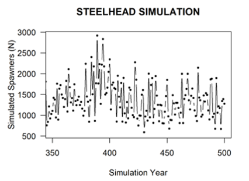{#07_life_cycle_model-07_life_cycle_model-07_life_cycle_model-07_life_cycle_model-07_life_cycle_model-fig-steelhead-spawners}

<div>

Simulation of Steelhead Spawners (y-axis) with stage_1 (parr) capacity set to 160,000.

</div>

#### Step 1: Identify Which Life Stages Have Density-Dependent Bottlenecks

First we identify which life stages have density-dependent bottlenecks and we define these in the life cycle profile csv file. These are generally added to the bottom of the life cycle parameters csv file. This will tell the model where to apply density-dependent bottlenecks and which functions to use.

**For Non-anadromous Populations like Rainbow Trout, Bull Trout, Cutthroat Trout etc.**

For non-anadromous (iteroparous) populations of resident trout and char, spawning more than once in their life cycle, the following density-dependent tags are available. Add these to the bottom of the life cycle profile csv in the **Name** column and set **Value** to TRUE.

+---------------------------------+---------------+--------------------------------------------------------------------------------------------------------------------------------------------------------------------------------------------------------------------------------------------------------------------------------------------------------------------------+
| Name                            | Mechanism     | Description                                                                                                                                                                                                                                                                                                              |
+=================================+===============+==========================================================================================================================================================================================================================================================================================================================+
| `bh_stage_0`                    | Beverton-Holt | Egg-to-fry transition. K0 = max fry capacity. BH curve applied with alpha = egg survival (sE) and Nt1 = egg count.                                                                                                                                                                                                       |
+---------------------------------+---------------+--------------------------------------------------------------------------------------------------------------------------------------------------------------------------------------------------------------------------------------------------------------------------------------------------------------------------+
| `hs_stage_0`, `dd_hs_0`         | Hockey-Stick  | Egg-to-fry hard cap. Fry count is truncated to K0 if exceeded.                                                                                                                                                                                                                                                           |
+---------------------------------+---------------+--------------------------------------------------------------------------------------------------------------------------------------------------------------------------------------------------------------------------------------------------------------------------------------------------------------------------+
| `bh_stage_1`, `bh_stage_2`, ... | Beverton-Holt | Constrains the transition INTO the named stage. K = capacity of the destination stage. For example, `bh_stage_1` constrains the fry-to-stage-1 transition (alpha = s0, Nt1 = fry count, K = K1). `bh_stage_2` constrains stage-1-to-stage-2 (alpha = s1, Nt1 = N_prev stage 1, K = K2).                                  |
+---------------------------------+---------------+--------------------------------------------------------------------------------------------------------------------------------------------------------------------------------------------------------------------------------------------------------------------------------------------------------------------------+
| `hs_stage_1`, `hs_stage_2`, ... | Hockey-Stick  | Hard cap on the population OF the named stage. If N in that stage exceeds K, it is truncated to K. For example, `hs_stage_1` caps stage-1 abundance at K1; `hs_stage_2` caps stage-2 abundance at K2. Note: HS caps the current population (a state constraint), while BH constrains the transition (a flow constraint). |
+---------------------------------+---------------+--------------------------------------------------------------------------------------------------------------------------------------------------------------------------------------------------------------------------------------------------------------------------------------------------------------------------+
| `bh_spawners`                   | Beverton-Holt | Total spawner capacity across all mature age classes. Mature stages are identified via the maturity vector (mat \> 0). When total spawners exceed the cap, K is redistributed proportionally across spawning stages, and BH is applied per-stage. Requires `k_stage_B_mean` in the habitat capacities file.              |
+---------------------------------+---------------+--------------------------------------------------------------------------------------------------------------------------------------------------------------------------------------------------------------------------------------------------------------------------------------------------------------------------+
| `hs_spawners`                   | Hockey-Stick  | Total spawner hard cap across all mature age classes. When total spawners exceed the cap, all spawning stages are reduced proportionally. Requires `k_stage_B_mean` in the habitat capacities file.                                                                                                                      |
+---------------------------------+---------------+--------------------------------------------------------------------------------------------------------------------------------------------------------------------------------------------------------------------------------------------------------------------------------------------------------------------------+

**For Anadromous Populations like Chinook, Coho, Sockeye, Chum, Pink etc.**

For anadromous (semelparous) populations of salmon, spawning only once in their life cycle and then dying, the following density-dependent tags are available. Add these to the bottom of the life cycle profile csv in the **Name** column and set **Value** to TRUE. The tags are similar to the non-anadromous tags but require a `pb` (pre-breeder) or `b` (breeder) prefix to distinguish between non-spawning and spawning stage classes.

+---------------------------------------------------------------------------+---------------+------------------------------------------------------------------------------------------------------------------------------------------------------------------------------------------------------------------------------------------------------------------------------------------------------------------------------------------------------+
| Name                                                                      | Mechanism     | Description                                                                                                                                                                                                                                                                                                                                          |
+===========================================================================+===============+======================================================================================================================================================================================================================================================================================================================================================+
| `bh_stage_0`                                                              | Beverton-Holt | Egg-to-fry transition. K0 = max fry capacity. Same tag as non-anadromous; does not need 'pb' or 'b'.                                                                                                                                                                                                                                                 |
+---------------------------------------------------------------------------+---------------+------------------------------------------------------------------------------------------------------------------------------------------------------------------------------------------------------------------------------------------------------------------------------------------------------------------------------------------------------+
| `hs_stage_0`                                                              | Hockey-Stick  | Egg-to-fry hard cap. Same tag as non-anadromous; does not need 'pb' or 'b'.                                                                                                                                                                                                                                                                          |
+---------------------------------------------------------------------------+---------------+------------------------------------------------------------------------------------------------------------------------------------------------------------------------------------------------------------------------------------------------------------------------------------------------------------------------------------------------------+
| `bh_stage_pb_1`, `bh_stage_pb_2`, ... `bh_stage_b_3`, `bh_stage_b_4`, ... | Beverton-Holt | Constrains the transition INTO the named pre-breeder (Pb) or breeder (B) stage. For example, `bh_stage_pb_1` constrains fry-to-stage-1 (alpha = s0, Nt1 = fry count, K = K1). The 'pb' tag targets pre-breeder stages; the 'b' tag targets specific spawner (breeder) stages. For spawner caps pooled across age classes, use `bh_spawners` instead. |
+---------------------------------------------------------------------------+---------------+------------------------------------------------------------------------------------------------------------------------------------------------------------------------------------------------------------------------------------------------------------------------------------------------------------------------------------------------------+
| `hs_stage_pb_1`, `hs_stage_pb_2`, ... `hs_stage_b_3`, `hs_stage_b_4`, ... | Hockey-Stick  | Hard cap on the population OF the named pre-breeder or breeder stage. For example, `hs_stage_pb_1` caps stage-1 (Pb) abundance at K1. `hs_stage_b_4` caps the stage_B_4 spawner class. Note: HS caps the current population (a state constraint), while BH constrains the transition (a flow constraint).                                            |
+---------------------------------------------------------------------------+---------------+------------------------------------------------------------------------------------------------------------------------------------------------------------------------------------------------------------------------------------------------------------------------------------------------------------------------------------------------------+
| `bh_spawners`                                                             | Beverton-Holt | Total spawner capacity pooled across all spawner (B) age classes. When total spawners exceed the cap, K is redistributed proportionally across spawning stages and BH is applied per-stage. Requires `k_stage_B_mean` (or `k_spawners_mean`) in the habitat capacities file.                                                                         |
+---------------------------------------------------------------------------+---------------+------------------------------------------------------------------------------------------------------------------------------------------------------------------------------------------------------------------------------------------------------------------------------------------------------------------------------------------------------+
| `hs_spawners`                                                             | Hockey-Stick  | Total spawner hard cap pooled across all spawner (B) age classes. When total spawners exceed the cap, all spawning stages are reduced proportionally. Requires `k_stage_B_mean` (or `k_spawners_mean`) in the habitat capacities file.                                                                                                               |
+---------------------------------------------------------------------------+---------------+------------------------------------------------------------------------------------------------------------------------------------------------------------------------------------------------------------------------------------------------------------------------------------------------------------------------------------------------------+

::: callout-important
## Reminder: K = Destination Stage, DD Flag = Destination Stage

When reading the tables above, remember that every DD flag and every K column refers to the **destination (TO) stage**. The flag `bh_stage_1` does not mean "apply DD to stage 1 survival" — it means "constrain the number of individuals entering stage 1 from the previous stage (fry)." Similarly, `k_stage_1_mean` is the maximum capacity **of stage 1**, not of the fry that feed into it. See the complete transition reference table above for the full mapping.
:::

::: {.callout-note collapse="true"}
## Practical Example: Setting a Hard Cap at the Fry-to-Stage-1 Transition (Non-Anadromous)

To set a hard cap (Hockey-Stick DD constraint) at the fry-to-stage-1 transition for a non-anadromous run:

**In your life cycle params CSV**, add the following row:

```         
"hs_stage_1","hs_stage_1",TRUE
```

**In your habitat capacities CSV**, include a `k_stage_1_mean` column with your desired cap value (e.g., 5000).

This will hard-cap the stage-1 population at 5,000 individuals at each location. If you want the asymptotic Beverton-Holt curve instead of a hard cap, use `bh_stage_1` instead of `hs_stage_1` — same K column, different constraint shape. With BH, the stage-1 abundance will approach 5,000 asymptotically but never quite reach it; with HS, it will be truncated to exactly 5,000 if exceeded.
:::

**Select Target Density-Dependent Bottlenecks and Update the Life Cycle Profile File.**

We then need to select target density-dependent bottlenecks of interest (from the name tags above) and update the life cycle profile file to tell the model which life stages have density-dependent constraints and which functions to use (e.g., bh vs hs).

The life cycle profile file should look something like this. Use the exact naming convention in the Name column, set the Value column to TRUE and provide a custom entry in the Parameters column as a user-friendly reminder of which life stage the density-dependent constraint is being applied to.

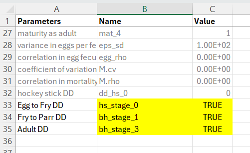{fig-alt="Updated life cycle profile file for a non-anadromous population with several density-dependent functions added" fig-align="center"}

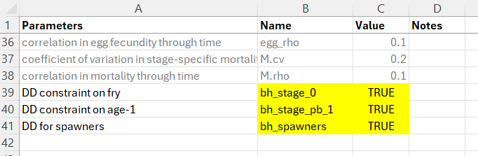{fig-align="center"}

#### Step 2: Create the Location-Specific Habitat Capacities File

In the previous step we told the model which life stages have density-dependent constraints and which density-dependent functions to use, but we still need to specify the location-specific K (capacity) values for each life stage. For example, if we know we have density-dependent constraints on egg-to-fry, fry-to-parr, and spawners, we need to specify the upper carrying capacities for each of fry, parr, and spawners for each location. We enter this information in the habitat capacities file.

The habitat capacities file can be generated as an Excel or csv file and defines the upper carrying capacity for each location (as rows) and each life stage at the target location (column values). The habitat capacities file always begins with columns HUC_ID (location id) and NAME (location or reach name), and then includes a series of wildcard columns that define the maximum number of individuals that the location is able to support for that life stage. See the examples below:

**Example Habitat Capacities File for a Non-Anadromous Population**

+------------+------------+--------------------+--------------------+--------------------+
| **HUC_ID** | **NAME**   | **k_stage_0_mean** | **k_stage_1_mean** | **k_stage_3_mean** |
+------------+------------+--------------------+--------------------+--------------------+
| 1          | Reach 1    | 627,594            | 238,987            | 38,073             |
+------------+------------+--------------------+--------------------+--------------------+
| 2          | Reach 2    | 1,247,555          | 537,196            | 15,384             |
+------------+------------+--------------------+--------------------+--------------------+
| 3          | Reach 3    | 913,589            | 359,136            | 20,943             |
+------------+------------+--------------------+--------------------+--------------------+

In the previous table we have the HUC_ID & NAME columns for the location - to link information to the stressor data, and then we have a series of additional columns:

-   k_stage_0_mean: Fry (age-0) capacity at the location. K0 constrains the egg-to-fry transition. If `hs_stage_0` or `bh_stage_0` is set to TRUE in the life cycle file, fry abundance will be restricted to this value (627,594 for Reach 1 in this example).

-   k_stage_1_mean: Stage 1 capacity (e.g., parr). K1 constrains the fry-to-stage-1 transition. If `bh_stage_1` is set to TRUE in the life cycle file, a Beverton-Holt curve will limit the number of stage-1 individuals based on fry abundance and fry survival (s0). If `hs_stage_1` is used instead, a hard cap is applied.

-   k_stage_3_mean: Stage 3 capacity. K3 constrains the stage-2-to-stage-3 transition. Requires `bh_stage_3` or `hs_stage_3` in the life cycle file.

Additional columns can be added for `k_stage_4_mean` etc. provided that they are defined in the life cycles file. To constrain total spawners across all mature age classes, include a `k_stage_B_mean` column and set `bh_spawners` or `hs_spawners` to TRUE in the life cycle file. Next we show an example for an anadromous population.

**Example Habitat Capacities File for an Anadromous Population**

+------------+------------+--------------------+-----------------------+---------------------+
| **HUC_ID** | **NAME**   | **k_stage_0_mean** | **k_stage_Pb_1_mean** | **k_spawners_mean** |
+------------+------------+--------------------+-----------------------+---------------------+
| 1          | Reach 1    | 627,594            | 273,052               | 38,073              |
+------------+------------+--------------------+-----------------------+---------------------+
| 2          | Reach 2    | 1,247,555          | 134,284               | 15,384              |
+------------+------------+--------------------+-----------------------+---------------------+
| 3          | Reach 3    | 913,589            | 89,385                | 20,943              |
+------------+------------+--------------------+-----------------------+---------------------+

In the previous table we have the HUC_ID & NAME columns for the location - to link information to the stressor data, and then we have a series of additional columns. These are similar to but slightly different than the non-anadromous populations because we need to specify Pb (pre-breeder) vs B (breeder):

-   k_stage_0_mean: Fry (age-0) capacity at the location. K0 constrains the egg-to-fry transition. Same column name as non-anadromous; no 'pb' or 'b' prefix needed for the fry stage class.

-   k_stage_Pb_1_mean: Stage 1 pre-breeder (Pb) capacity (e.g., parr). K1 constrains the fry-to-stage-1 transition. If `bh_stage_pb_1` or `hs_stage_pb_1` is set to TRUE in the life cycle file, the number of stage-1 (Pb) individuals will be constrained at this location.

-   k_spawners_mean: Total spawner capacity pooled across all spawner age classes. Alternative column names (`k_stage_B_mean`, `k_stage_b_mean`) will also work. Requires `bh_spawners` or `hs_spawners` in the life cycle file. You can also specify capacities for individual spawner age classes (e.g., `k_stage_B_4_mean`, `k_stage_B_5_mean`) but this assumes the age-class proportions are well-known and consistent.

::: callout-important
## Reminder: Column Names = Destination Stage Capacity

Each `k_stage_X_mean` column specifies the capacity **of stage X** (the destination). For example, `k_stage_1_mean = 5000` means "this location can support up to 5,000 stage-1 individuals." The constraint is applied to individuals entering or occupying stage 1 — not to the fry that feed into it. The model output for stage 1 at this location will reflect the **post-bottleneck** abundance (i.e., after the BH curve or HS cap has been applied).
:::

*Note: only include K columns for stages that have density-dependent flags set in the life cycle file. Columns with NA or missing values are allowed — the model will skip density dependence for those stages at that location.*

#### Step 3: Final Checks

-   Define stage/age classes with known or expected density dependent constraints

-   Update the life cycle profile file to include target density dependent bottlenecks with their associated functions (e.g., `hs_stage_0, bh_spawners etc.`). Set the Value column to TRUE so they will be applied in the model

-   Create or update the habitat capacities file. Define the K capacity values for each location and life stage.

-   **Recommended**: Run the model in the Shiny app to ensure it is functioning as intended.

### Compensation Ratios for Density-Dependent Growth (Optional for Advanced Use-Cases)

> **Most users should skip this section.** Compensation ratios are a legacy mechanism retained for backward compatibility and specialized research applications. In practice, the location and stage-specific carrying capacities described above (with Beverton-Holt or Hockey-Stick functions) provide a simpler, more transparent, and more flexible way to implement density dependence. Use-cases where compensation ratios are genuinely preferable are rare — typically limited to situations where stage-specific K values cannot be estimated independently and the only available information is an overall adult carrying capacity plus literature-derived compensation ratio estimates. **If you are unsure which approach to use, use stage-specific carrying capacities and set all compensation ratios to 1.0.**

It is technically possible to combine compensation ratios with location and stage-specific carrying capacities, but this is strongly discouraged as it makes model behavior difficult to interpret and diagnose.

Compensation ratios (CR values) are a reparameterization of the classical Beverton-Holt function for density-dependent growth. They derive stage-specific K values from the stable-stage distribution of the transition matrix, which means the user only controls adult K directly — all other stage capacities are calculated automatically. This is less flexible than specifying stage-specific K values directly.

#### Compensation Ratio CR for life stage i:

Compensation Ratios (CR) adjust the survivorship of each life stage based on the observed densities (abundance, Ni,t) and stage-specific carrying capacities (Ki):

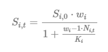{#07_life_cycle_model-07_life_cycle_model-07_life_cycle_model-07_life_cycle_model-07_life_cycle_model-fig-compensation-ratio}

In the CR equation above, Si,0 is the baseline survivorship (surv_X) under density-independent growth conditions; wi is the compensation ratio (CR value) of life stage i; Ni,t is the current number of individuals in life stage i in a given time step (t); and Ki is the carrying capacity of life stage i. The compensation ratios, in essence, modify the survivorship of each life stage based on how far the stage-specific abundance (Ni,t) has departed from its assumed carrying capacity (Ki).

A plot of compensation ratios is provided below to illustrate their effects on stage-specific survivorship transitions. In this example, abundance values of a hypothetical stage class (i) are plotted along the x-axis with a carrying capacity (Ki) set to 100 individuals (blue vertical line). The hypothetical stage class (i) has a baseline survivorship (productivity) value of 0.8 in the absence of density-dependent growth conditions (horizontal red line). The y-axis on the plot shows how the default survivorship value of 0.8 is modified based on the stage-specific compensation ratio for stage class (CRi). The survivorship value for the stage class is suppressed as the abundance values exceed the carrying capacity K. The effects are amplified as compensation ratios are increased. Compensation ratios of 1.0 leave the vital rate unmodified. Compensation ratios less than 1.0 increase survivorship values (allowing for a potential positive effect of density). When the abundance of the age class is less than the carrying capacity, baseline survivorship values can actually increase. However, within the model code, adjusted survivorship values are fixed so that they never exceed 1.0 for any stage transition.

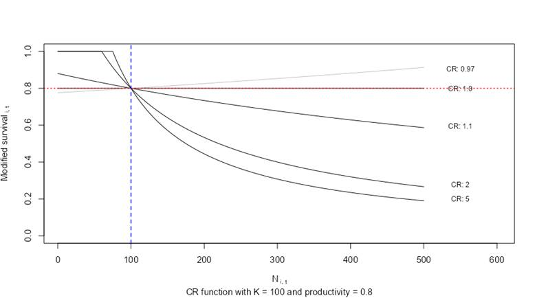{#07_life_cycle_model-07_life_cycle_model-07_life_cycle_model-07_life_cycle_model-07_life_cycle_model-fig-compensation-ratios-effect}

<div>

Influence of compensation ratios on stage-specific survivorship.

</div>

#### Compensation Ratios & Stage-Specific Carrying Capacity Estimates:

When using compensation ratios, it is only possible to modify the carrying capacity for the adult age class via the K parameter in the life cycle profile. The K values for other age classes are derived from the stable-stage distribution of the underlying transition matrix. This means that users who implement density-dependent growth via compensation ratios can only modify stage-specific abundance relative to the stable stage distribution. If you know (or can estimate) critical location-specific and stage-specific capacities (e.g., maximum stage_1 parr at location X), then refer to the *Location and Stage-Specific Carrying Capacities* section above to implement density-dependent growth constraints directly.

Stage-specific capacities (K) with compensation ratios:

-   K (Stage-0, eggs): Calculated as the product of the number of individuals in all mature age classes, multiplied by maturation probabilities for each class, the number of spawning events, eggs per female, sex ratio and spawning interval.
-   K (Stage-0, fry): K values for young-of-the-year (fry/Age-0) individuals are calculated as the product of K (Stage-0, eggs) \* the egg survival (SE).
-   K (Stage-1): Calculated from the stable-stage distribution of the transition matrix (B) after setting the adult stage (Stage-4) to K (e.g., 100).
-   K (Stage-2): Calculated from the stable-stage distribution of the transition matrix (B) after setting the adult stage (Stage-4) to K (e.g., 100).
-   K (Stage-3): Calculated from the stable-stage distribution of the transition matrix (B) after setting the adult stage (Stage-4) to K (e.g., 100).
-   K (Stage-4): Manually input by the user for the population of interest. This assumes that stage-4 is the only mature age class.

Stable-stage distribution (portions) under the example species profile @fig-figure27:

#### Stable Stage Distributions (as a fraction 0 - 1) & Stage-specific Carrying Capacities (K):

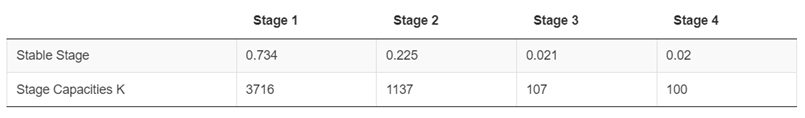{#07_life_cycle_model-07_life_cycle_model-07_life_cycle_model-07_life_cycle_model-07_life_cycle_model-fig-stable-stage-distributions}

#### Compensation Ratios and the Density-Dependence Matrix (D):

Based on the derived stage-specific carrying capacities (K values), baseline survivorship values (SE, S0, surv_1, ...) and the corresponding compensation ratios (cr_E, cr_0, cr_1, ...), a density-dependence matrix (D) for a hypothetical population vector of eggs: 10,000,000, fry: 1,000,000; stage 1: 100,000, stage 2: 10,000, stage 3: 1,000 & stage 4: 100 will appear as follows:

The density-dependence matrix (D) contains vital rate modifiers for the estimated survivorship values at each stage transition. The density-dependence matrix (D) is multiplied with the corresponding transition matrix (B, Table 2) of density-independent transition probabilities. The finalized projection matrix (A) is the product of the density-dependent matrix (D), and the transition matrix (B) \[A is a product of B\*D = A\]. The density-dependent matrix changes with each time step based on the number of individuals. The projection matrix (A) is, therefore, recalculated for each time step.

Compensation ratios are widely used as parameters in stock-recruitment functions, although they are admittedly less popular in classical matrix life cycle modeling. Steepness (the proportion of recruitment produced when stock size is reduced to 20% of initial biomass) is sometimes used in place of compensation ratios. Numerous other methods exist to introduce density dependence into stage-structured life cycle models. The compensation ratios are available as a default option for the CEMPRA tool to represent a versatile mechanism for applications to a large number of hypothetical species profiles. If location and stage-specific carrying capacities can be estimated, we strongly recommend that users set all compensation ratios to 1.0 for each stage class (thereby disabling compensation ratios) and use the *Location and Stage-Specific Carrying Capacities* section above for density-dependent growth with Beverton-Holt or Hockey-Stick functions instead. For additional background, please review the following references to learn more about compensation ratios and life cycle modeling with density-dependent growth.

**Compensation Ratios in the Species Profile**

+------------------------------------+--------------------------------------------------------------------------------------------------------------------------------------------------------------------------------------------------------------------------------------------------------------------------------------------------------------------+
| Parameter                          | Description                                                                                                                                                                                                                                                                                                        |
+====================================+====================================================================================================================================================================================================================================================================================================================+
|                                    |                                                                                                                                                                                                                                                                                                                    |
+------------------------------------+--------------------------------------------------------------------------------------------------------------------------------------------------------------------------------------------------------------------------------------------------------------------------------------------------------------------+
| cr_E, cr_0, cr_1, cr_2, cr_3, cr_4 | The compensation ratios for egg (cr_E), Age-0 fry (cr_0) and subsequent stage classes (cr_1 to cr_4) can be set. If the Nstage value is different than four, then add or remove rows accordingly. Compensation ratios can be set to 1.0 to omit the use of compensation ratios to govern density-dependent growth. |
+------------------------------------+--------------------------------------------------------------------------------------------------------------------------------------------------------------------------------------------------------------------------------------------------------------------------------------------------------------------+

#### Useful references to understand Compensation Ratios:

To further understand compensation ratios and their application in life cycle modeling, the following references are recommended:

-   Goodyear, C. P. (1980). Compensation in fish populations. Biological monitoring of fish, 253-280.
-   Myers, R. A. (2001). Stock and recruitment: generalizations about maximum reproductive rate, density dependence, and variability using meta-analytic approaches. ICES Journal of Marine Science, 58(5), 937-951.
-   Rose, K. A., Cowan Jr, J. H., Winemiller, K. O., Myers, R. A., & Hilborn, R. (2001). Compensatory density dependence in fish populations: importance, controversy, understanding and prognosis. Fish and Fisheries, 2(4), 293-327.
-   Myers, R. A., Bowen, K. G., & Barrowman, N. J. (1999). Maximum reproductive rate of fish at low population sizes. Canadian Journal of Fisheries and Aquatic Sciences, 56(12), 2404-2419.
-   Walters, C. J., & Martell, S. J. (2004). Fisheries ecology and management. Princeton University Press.
-   Forrest, R. E., McAllister, M. K., Dorn, M. W., Martell, S. J., & Stanley, R. D. (2010). Hierarchical Bayesian estimation of recruitment parameters and reference points for Pacific rockfishes (Sebastes spp.) under alternative assumptions about the stock--recruit function. Canadian Journal of Fisheries and Aquatic Sciences, 67(10), 1611-1634.

## Linking Stressor-Response Relationships to Vital Rates in the Population Model

Up to this point, we have only created a general population model, but we have not yet linked any of our stressors or stressor-response relationships to the life cycle model. In this section we will go over how to define linkages between each of the stressor response relationships and specific vital rates in the population model.

A key feature of the population model is the ability to link environmental stressors directly to **life-stage-specific vital rates**. This is configured in the **Stressor-Response Excel Workbook** through the `Life_stages` and `Parameters` columns on the Main worksheet.

### Stressor-Response Workbook Structure

Recall from earlier chapters and the [Joe Model Tutorials](https://essatech.github.io/CEMPRA/articles/a01-joe-model.html) that the stressor-response workbook contains a **Main** worksheet that indexes all stressors. For the population model, two additional columns become critical (the Life_stages and the Parameters columns).

By carefully defining these columns we can effecively link stressor-response relationships to specific vital rates. However, each stressor-response relationship can be linked to only one vital rate. If multiple linkages are desired then duplicate the stressor & stressor-response relationship accordingly in the Stressor Magnitude and Stressor-Response workbook (e.g., SummerStreamTemp_Parr, SummerStreamTemp_Prespawn).

### The Stressor-Response Workbook 'Parameters' Column

The in the Stressor-Response workbook `Parameters` column specifies **how** the stressor-response relationship affects the vital rate of interest. There are three possible values:

+-----------------+------------------------------+----------------------------------------------------------------------------------------------------------------------------------------------------------+
| Value           | Effect                       | Description                                                                                                                                              |
+=================+==============================+==========================================================================================================================================================+
| `capacity`      | Reduces carrying capacity    | The stressor reduces the maximum number of individuals that habitat can support at the target life stage (K). This affects density-dependent regulation. |
+-----------------+------------------------------+----------------------------------------------------------------------------------------------------------------------------------------------------------+
| `survival`      | Reduces survival probability | The stressor directly reduces the survival rate (S) for the target life stage. This is a density-independent effect.                                     |
+-----------------+------------------------------+----------------------------------------------------------------------------------------------------------------------------------------------------------+
| `fecundity`     | Reduces reproductive output  | The stressor reduces eggs per spawner (eps). Less commonly used.                                                                                         |
+-----------------+------------------------------+----------------------------------------------------------------------------------------------------------------------------------------------------------+
| *blank* or `NA` | Joe Model only               | The stressor contributes to system capacity but is not linked to the population model.                                                                   |
+-----------------+------------------------------+----------------------------------------------------------------------------------------------------------------------------------------------------------+

**Example interpretation:**

-   A stressor with `Parameters = "capacity"` and `Life_stages = "stage_0"` reduces the fry carrying capacity. If the system capacity score is 0.70, the fry capacity (K0) is reduced to 70% of baseline.
-   A stressor with `Parameters = "survival"` and `Life_stages = "stage_1"` reduces stage-1 survival. If the system capacity score is 0.85, the stage-1 survival rate is multiplied by 0.85.

### The Stressor-Response Workbook 'Life_stages' Column

The `Life_stages` column specifies **which life stage(s)** (or specific vital rate) the stressor affects. The population model recognizes stage-specific tags and several convenient aliases.

### Stage-Specific Tags (Recommended)

For clarity and precision, we recommend using explicit stage numbers:

**Survival 'Life_stages' Tags for Non-Anadromous Populations:**

| Life_stages Column        | Target Vital Rate               |
|---------------------------|---------------------------------|
| `stage_E`, `SE`           | Egg survival                    |
| `stage_0`, `S0`           | Age-0 fry/sub-yearling survival |
| `stage_1`, `S1`, `surv_1` | Stage 1 survival                |
| `stage_2`, `S2`, `surv_2` | Stage 2 survival                |
| ... up to `stage_12`      | Higher stages as needed         |

**Capacity 'Life_stages' Tags for Non-Anadromous Populations:**

| Tag(s)                | Target                  |
|-----------------------|-------------------------|
| `SE`, `stage_E`, `KE` | Egg capacity (Ke)       |
| `stage_0`, `S0`, `K0` | Fry capacity (K0)       |
| `stage_1`, `S1`, `K1` | Stage 1 capacity        |
| `stage_2`, `S2`, `K2` | Stage 2 capacity        |
| ... up to `stage_12`  | Higher stages as needed |

#### Anadromous-Specific **'Life_stages'** Tags

For anadromous species, additional Life_stages column tags target pre-breeder (Pb) and spawner (Breeder - B) classes:

**Pre-breeder Survival (Pb):**

| **'Life_stages'** Tag(s) | Target                          |
|--------------------------|---------------------------------|
| `stage_E`, `SE`          | Egg survival                    |
| `stage_0`, `S0`          | Age-0 fry/sub-yearling survival |
| `stage_Pb_1`             | Pre-breeder stage 1 survival    |
| `stage_Pb_2`             | Pre-breeder stage 2 survival    |
| ... up to `stage_Pb_12`  | Higher stages as needed         |

**Pre-breeder Capacity (Pb):**

| Tag(s)                  | Target                       |
|-------------------------|------------------------------|
| `stage_Pb_1`            | Pre-breeder stage 1 capacity |
| `stage_Pb_2`            | Pre-breeder stage 2 capacity |
| ... up to `stage_Pb_12` | Higher stages as needed      |

**Spawner Capacity (B):**

+--------------------------------------------+-------------------------------------------+
| Tag(s)                                     | Target                                    |
+============================================+===========================================+
| `spawners`                                 | All spawner capacity (pooled across ages) |
+--------------------------------------------+-------------------------------------------+
| `spawn_1`, `spawners_1`, `B1`, `stage_B_1` | Age-specific spawner capacity             |
+--------------------------------------------+-------------------------------------------+
| ... up to `spawn_12`                       | Higher ages as needed                     |
+--------------------------------------------+-------------------------------------------+

**Pre-spawn and Migration Survival (Anadromous only):**

+---------------------------------------+---------------------------------+
| Tag(s)                                | Target                          |
+=======================================+=================================+
| `spawners`                            | All pre-spawn survival (u)      |
+---------------------------------------+---------------------------------+
| `prespawn_1`, `u1` ... `u12`          | Age-specific pre-spawn survival |
+---------------------------------------+---------------------------------+
| `smig`, `spawn_mig`                   | All spawner migration survival  |
+---------------------------------------+---------------------------------+
| `smig_1`, `spawn_mig_1` ... `smig_12` | Age-specific migration survival |
+---------------------------------------+---------------------------------+

#### Fecundity Tags

| Tag                   | Target                                   |
|-----------------------|------------------------------------------|
| `eps`                 | Eggs per spawner (all ages)              |
| `eps_3`, `eps_4`, ... | Age-specific fecundity (anadromous only) |

#### Notes on **'Life_stages' linkage Tags** Tags

-   Tags are **case-insensitive** (converted to lowercase internally)
-   **Underscores and spaces are removed** during processing (e.g., `stage_1` and `stage1` are equivalent)
-   You can specify **multiple life stages** separated by commas (e.g., `stage_1, stage_2`), but we recommend having a 1:1 relationship between a stressor-response relationship and a vital rate linkage. We recommend duplicating stressors in the stressor-magnitude and stressor-response relationship workbook for 1:many relationships between stressors and vital rates.

## Tips on Building a New Life Cycle Profile From Scratch

A customized life cycle profile can be developed using the following template: [Life Cycle Profile Template](https://github.com/essatech/CEMPRAShiny/blob/main/data/demo/life%20cycles.csv).

Appendix B includes sample species profiles for case study systems, such as Nicola Basin Chinook Salmon, Steelhead, and Coho Salmon. The COMPADRE (plant) and COMADRE (animal) online archives also offer vital rates for numerous species as of March 2023 ([COMADRE Database](https://compadre-db.org/Data/Comadre)). These archives can be valuable resources for reviewing vital rate estimates for similar species and taxa.

It's recommended to first summarize the species' life cycle using a simple diagram to represent key life stages. This diagram can be converted into a periodicity table (or life history schedule) to represent time spent in each life stage, as shown in the figure. A life history diagram coupled with a periodicity table can be helpful in mapping out transitions between key stages in the life cycle model. Recall that the life cycle model works with annual time steps. "Census" periods within the matrix model do not need to fall precisely at the one-year interval, but care should be taken to ensure that key transitions are not missed or double-counted. It is best to start from the spawning period and work forward, following a whole generation to its progeny

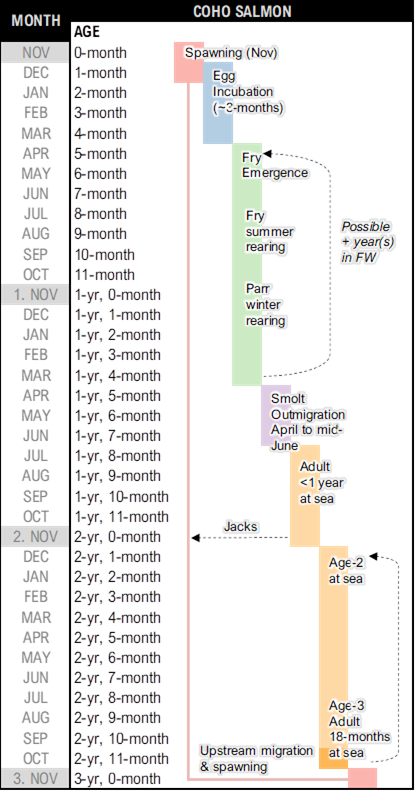{#07_life_cycle_model-07_life_cycle_model-07_life_cycle_model-07_life_cycle_model-07_life_cycle_model-fig-coho-salmon-lifecycle}

<div>

Sample combo life cycle diagram and periodicity table for a coastal population of Coho Salmon in British Columbia

</div>

Users can load a draft species profile into the R-Shiny application and modify it as needed. It is important to review the eigenanalysis of the projection matrix to ensure that lambda estimates, generation time, and stable-stage distributions align with expectations based on the species' life history.

**Parameters to double-check:**

-   Lambda (λ, instantaneous growth rates) estimates are reasonable (not substantially different from 1.0). If lambda estimates are lower than 1.0, review parameters.
-   Generation time approximately matches the characterization of the species' life history in the literature.
-   Stable-stage distributions from the projection matrix are not substantially different from expectations.

## Benefits and Limitations

The life cycle modeling component of the CEMPRA tool is a valuable resource for understanding and quantifying cumulative effects, linking critical stressors to key life stages, and supporting an understanding of the relevance of key drivers curtailing productivity and capacity. Related analyses have provided a useful framework to synthesize pathways for cumulative effects through the lens of population ecology ([@beechie2021modeling]; [@jorgensen2021identifying]; [@sorel2022informing]; [@kendall2023life]). Simulations allow user groups to play out hypothetical scenarios with multiple stressors, locations, and species profiles, making it possible to perform many complex calculations within a simple user interface.

However, there are key limitations to the CEMPRA tool and life cycle modeling in general. Depending on the parameterization of a species profile, there can be key stages and vital rates that are highly sensitive to perturbation. It can be challenging to discern whether these sensitivities reflect actual vulnerabilities in nature or are artifacts of the modeling framework. Therefore, some researchers emphasize the need to treat life cycle models as hypothesis generators until predictions and causal pathways can be empirically validated ([@roni2018review]).

The CEMPRA tool does not account for complex variations in life history strategies, seasonal movement, individual exposure, and detailed habitat criteria. Therefore, it's up to the users to carefully design stressor variables, stressor magnitude datasets, and stressor-response relationships such that linkages are already largely accounted for in the underlying input data. When summarizing results, it is advisable for user groups to focus on reviewing relative differences between scenarios compared to a default (status-quo) reference scenario. Interpreting results as relative differences is more relatable than trying to rationalize absolute values (e.g., *"scenario A increased system capacity by \~10% relative to scenario B"* vs *"scenario A increased capacity by 321 fish relative to scenario B"*).

User groups and practitioners should use life cycle models to help develop high-level goals for restoration and recovery programs ([@roni2018review]). While useful for identifying key demographic bottlenecks and the sensitivity of those bottlenecks to the range of stressor values observed on the landscape (or projected through simulation), life cycle models are less useful for designing small-scale projects. Efforts should continue to validate and refine predictions with field data and empirical studies.

**Review applicable R-package tutorials to explore this further - [Tutorials](https://essatech.github.io/CEMPRA/index.html).**

------------------------------------------------------------------------