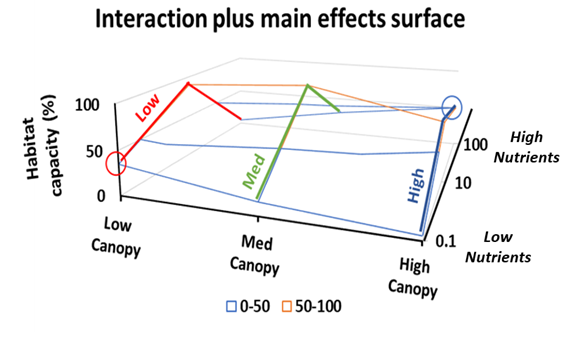
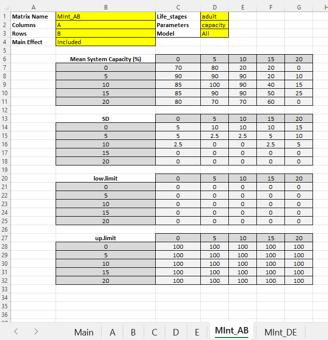
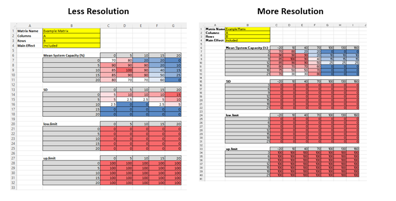
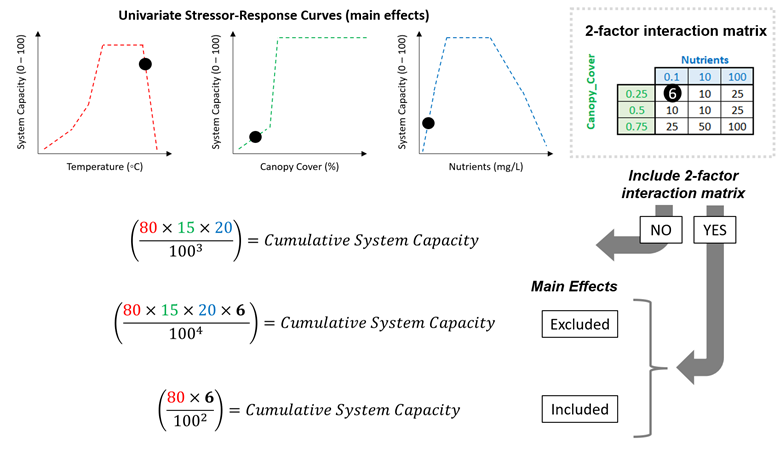

# Appendix B - Multi-Stressor Interaction Matrix {.unnumbered}

## Overview

Most stressors in the CEMPRA tool act independently: each one has its own stressor-response curve, and their system capacity scores are multiplied together. Sometimes that is not realistic - the effect of one stressor depends on the level of another (antagonistic or synergistic interactions, conditional effects, attenuating or exacerbating factors). The optional **two-factor interaction matrix** lets you describe the combined effect of two stressors directly: a simple lookup table of mean system capacity (%) at each combination of the two stressor levels.

A hypothetical example (@fig-figure1) shows the interaction between stream canopy cover (low to high) and nutrients (as total phosphorus). At low nutrients, habitat capacity for trout is highest under low canopy cover, where high light maximizes algal and invertebrate production (red circle). However, at high nutrients (eutrophic conditions), habitat capacity is highest under a closed canopy that suppresses algal growth and the associated high temperatures and poor water quality (blue circle). A single canopy-cover curve could never capture this reversal - the interaction matrix can.

{#fig-figure1}

Interaction matrices are built from data or expert opinion, just like the single-stressor curves. They are also a convenient way to explore hypothetical or experimental scenarios.

## What Goes in the Main Worksheet (and What Does Not)

This is the most common point of confusion, so let's be explicit:

-   **The two main-effect stressors NEED entries in the Main worksheet.** The two stressors on the matrix axes are ordinary stressors in every respect: each needs its own row in the Main worksheet, its own stressor-response worksheet (named exactly after it), and its own rows in the stressor *magnitude* workbook. The matrix reads its input doses from their magnitude values.
-   **The matrix itself gets NO entry in the Main worksheet.** An interaction matrix exists only as its own `MInt_` worksheet. It is recognized purely by its worksheet name.
-   **What happens if you add a Main row for the matrix anyway?** The workbook fails to load. The Main worksheet enforces a strict pairing - every row must have a same-named curve worksheet - and `MInt_` sheets are excluded from that pairing. A Main row named `MInt_AB` therefore has no matching curve worksheet, and the upload stops with *"Bad worksheet names: ... Stressors with no matching worksheet: MInt_AB"*.
-   The matrix also gets **no rows in the stressor magnitude workbook** - only its two axis stressors do.

If an axis stressor name in the matrix header does not match any stressor in the Main worksheet (a typo or a stray space), you now get a clear warning when the workbook is uploaded, naming the sheet and the missing stressor. A matrix with an unmatched axis is skipped at run time.

## Building the MInt\_ Worksheet

Interaction matrices are added as extra tabs in the stressor response workbook. The worksheet name must begin with "**MInt\_**" followed by a unique name, ideally without spaces (e.g., `MInt_AB`). Template workbooks are available in the R Shiny application sample datasets (*see the upload data tab*) and in the Worked Examples at the bottom of this appendix. The formatting must follow @fig-figure2.

{#fig-figure2}

### Header cells

The header section (cells A1:D3 plus A4:B4) must include:

-   **Matrix Name (cell B1):** A display name for the interaction. By convention this matches the worksheet name (e.g., `MInt_AB`). The worksheet name is the matrix's identity everywhere in the tool (checkboxes, results, the `stressors` argument); the Matrix Name is what gets displayed on cards and plots.
-   **Columns (cell B2):** The stressor whose dose values run **across the top** of each table (the x-axis). Spelling must match the Main worksheet exactly.
-   **Rows (cell B3):** The stressor whose dose values run **down the left side** of each table (the y-axis). Spelling must match the Main worksheet exactly.
-   **Main Effect (cell B4):** `Included` or `Excluded` - see the next section. Blank defaults to `Included`.
-   **Life_stages (cell D1):** `adult` for the standard Joe Model. A blank cell defaults to `adult`. (Capitalization does not matter.)
-   **Parameters (cell D2):** e.g., `capacity` - informational.
-   **Model (cell D3):** informational only. Matrices are available to both the Joe Model and the population model - which runs actually include a matrix is controlled by the run selections (the `stressors` argument in the R package, or the checkboxes in the Shiny app), not by this cell.

### The data tables

Below the header sit up to four tables, each introduced by its label in column B: **Mean System Capacity (%)**, **SD**, **low.limit** and **up.limit**. In each table, the label row also carries the *Columns* stressor's dose values extending to the right (starting in cell C6), and the first column carries the *Rows* stressor's dose values extending downward (starting in cell B7). The grid cells hold values in **percent (0-100)**.

Reading the example in @fig-figure2: for stressor A = 10 and stressor B = 5, look under column header 10 in the row labelled 5.

Rules for the tables:

-   **Only the mean table is required, and it must be completely filled.** A blank or non-numeric cell in the Mean System Capacity table is an error at upload (previously it silently zeroed the matrix's effect over part of the dose range).
-   **The SD, low.limit and up.limit tables are optional.** If a table is missing - or has blank cells - the defaults are **SD = 0** (deterministic), **low.limit = 0** and **up.limit = 100**. With SD = 0 everywhere, the matrix always returns the interpolated mean. With a nonzero SD, each simulation draws the matrix's system capacity from a truncated beta distribution between the low and up limits.
-   **All tables present must share the same dose axes** (same dimensions). A mismatch - usually caused by extra or missing blank rows between the tables - is a clear error at upload naming the offending tables.
-   You can use **any number of dose steps** on either axis, and the two axes do not need the same number of steps (@fig-figure4). Dose values may be entered ascending or descending - they are sorted automatically.
-   **Keep the area to the right of and below the tables clean.** Stray notes are tolerated (blank-header columns are stripped automatically), but it is better not to rely on that.

{#fig-figure4}

## Main Effect: Included vs. Excluded

The **Main Effect** cell answers one question: *do the numbers in your matrix already account for the individual (main) effects of the two stressors, or only the extra interactive effect?*

-   **Included (the default):** The matrix values represent the **entire** combined relationship - main effects and interaction together. The cumulative effect calculation therefore automatically **drops the two standalone stressor-response terms** and uses only the matrix, so nothing is double-counted. For example, with worksheets for "Nutrients", "Canopy_Cover" and a matrix for the pair, the Joe Model evaluates only the matrix for those two stressors (Y = other stressors + "Nutrients and Canopy_Cover").
-   **Excluded (experimental - apply with caution):** The matrix values represent **only the extra interactive effect**, over and above the main effects. The two standalone stressor-response terms stay in the calculation and the matrix is multiplied in as an additional term (Y = other stressors + "Nutrients" + "Canopy_Cover" + "Nutrients and Canopy_Cover"). This is convenient for quickly comparing scenarios with and without a customized interactive effect.

**Important note:** this is not a regression model - there is no intercept, no coefficients, and no link function. The matrix simply contributes a system capacity score that is multiplied into the cumulative effect like any other stressor.

The difference between the two settings is illustrated in @fig-figure3:

{#fig-figure3}

## How the Matrix Is Evaluated at Run Time

For each location (HUC) and each Monte Carlo simulation, the model:

1.  takes the two axis stressors' sampled dose values from the stressor magnitude workbook;
2.  clamps each dose to the matrix's axis range (doses beyond the edge of the grid use the edge value - no extrapolation);
3.  bilinearly interpolates the mean, SD and limit surfaces at that dose pair (dose values between grid steps are interpolated linearly on both axes);
4.  draws the matrix's system capacity from a truncated beta distribution (or returns the interpolated mean exactly, when SD = 0).

If a location is missing a magnitude value for either axis stressor, the matrix produces no result (NA) for that location - a console note reports how many location-simulation combinations were affected. The rest of the run continues normally.

## Including Matrices in a Joe Model Run

**In the R package**, interaction matrices load automatically with the stressor response workbook (`StressorResponseWorkbook()` returns them as `sr_wb_dat$MInt`, a named list keyed by worksheet name) and `JoeModel_Run()` applies every matrix by default. The `stressors` argument scopes both regular stressors and matrices:

``` r
# Everything in the workbook (all stressors + all matrices):
jm <- JoeModel_Run(dose = dose, sr_wb_dat = sr_wb_dat, MC_sims = 100)

# Main effects only - leave the matrix out of the selection:
jm <- JoeModel_Run(dose, sr_wb_dat, MC_sims = 100,
                   stressors = c("A", "B", "C"))

# Interaction only - select just the matrix by its worksheet name:
jm <- JoeModel_Run(dose, sr_wb_dat, MC_sims = 100,
                   stressors = "MInt_AB")
```

A matrix-only selection computes the two axis stressors internally (their doses feed the interpolation) but excludes them from the cumulative effect. When a matrix *and* its main effects are all selected, the matrix's Main Effect setting governs exactly as in a full run - an "Included" matrix absorbs its mains, so nothing is double-counted. In the results, the matrix appears in `sc.dose.df` under its own name with the interpolated system capacity (`dose` is NA - the matrix has no single dose of its own).

**In the R Shiny app**, matrices appear in two places:

-   **Main map page:** each matrix is a clickable card below the stressor list (under the "Interaction Matrices" header). Clicking the card colours the map by the matrix's interpolated surface for each location; the chart button opens the matrix tables for review.
-   **Joe Model run dialog:** each matrix has its own checkbox alongside the stressors. Check the matrix (and uncheck its two main effects, if you wish) to run interaction-only scenarios; leave everything checked and the Main Effect setting decides, exactly as above.

## Common Errors and Issues

-   **Axis name mismatches.** The Columns/Rows cells must spell the two stressor names exactly as they appear in the Main worksheet. Mismatches produce a warning at upload and the matrix is skipped at run time.
-   **A Main worksheet row for the matrix.** Do not add one - the workbook will fail to load (see *What Goes in the Main Worksheet* above).
-   **Blank cells in the mean table.** Not allowed - fill every cell (blank cells in the optional SD/limit tables are fine and take the defaults).
-   **Altered template layout.** The header cells (B1:B4, D1:D3) must stay in their original positions, and content in rows/columns adjacent to the tables can confuse the reader. Start from the template workbook in the Worked Examples below.

## Population Model

Interaction matrices can also be linked to vital rates in the population model. The same `MInt_` worksheet drives both models - only the interpretation of two header cells changes:

-   **Life_stages (cell D1)** names the population-model life stage(s) the matrix acts on (e.g., `stage_1`, `adult`, `eps_2`) - the same tags used in the Main worksheet's Life_stages column for regular stressors.
-   **Parameters (cell D2)** names the vital-rate parameter (`survival`, `capacity`, or `fecundity`).

Each simulation year, the matrix's system capacity is interpolated from the two axis stressors' sampled magnitudes and applied to the linked vital rate, multiplicatively alongside any other active stressors.

The behaviour differs from the Joe Model in one deliberate way: **the Main Effect setting is ignored in the population model.** You choose what contributes - run the two main-effect stressors, the matrix, or both. Whatever is selected acts, and a matrix selected together with its mains simply combines multiplicatively like any other pair of stressors. Nothing is absorbed or double-counted on your behalf.

-   **In the R package**, matrices in the workbook apply by default in `PopulationModel_Run()`, and the `stressors` argument selects them by worksheet name exactly as in `JoeModel_Run()` - matrix-only, mains-only, or both all work.
-   **In the R Shiny app** (Population Model page, *Stressor Magnitude Values*), matrices appear as cards below the stressors - each with a checkbox, the life stage / parameter linkage, and optional From Year / To Year inputs. There are no Mean/SD/limit boxes on a matrix card: the interaction surface provides the values. The cards only appear when the uploaded stressor response workbook actually contains `MInt_` worksheets. Enter magnitude values for both axis stressors (checked or not - the matrix reads their values either way), then check the matrix to include it in the projection.
-   A From/To year window on the matrix card restricts the matrix's effect to those simulation years, exactly like the windows on regular stressor cards.

If an axis stressor has no magnitude value, the matrix cannot be interpolated - the app shows a warning and the matrix is skipped for that run.

## Worked Examples

### Matrix Interaction (Example 1: Template)

This example is designed to demonstrate the two-factor matrix interaction surface. Given that the matrix interaction surface necessitates a specialized stressor response Excel workbook, this example can be utilized as a practical template for customization.

-   [Stressor Response Workbook](/sample_data/matrix_simple/stressor_response_matrix.xlsx)
-   [Stressor Magnitude Workbook](/sample_data/matrix_simple/stressor_magnitude_matrix.xlsx)
-   [Watershed Locations .shp (ZIP folder)](/sample_data/matrix_simple/poly.zip)

### Matrix Interaction (Example 2: Application)

The purpose of this second example is to demonstrate the matrix interaction surface through a practical case study. To simplify, we apply the British Columbia Freshwater Atlas (BCFWA) Assessment Watersheds. Here, we estimate hydrological runoff potential by multiplying two factors: a) the Biogeoclimatic Ecosystem Classification (BEC) Unit Score, and b) the percentage of Alpine non-Forested Area. It's important to note that hydrological runoff potential is not a standard stressor in the Joe Model; it is used here solely for illustration. See the original report here: [BC-CEF Interim Interim Assessment Protocol for Aquatic Ecosystems in British Columbia](https://www2.gov.bc.ca/assets/gov/environment/natural-resource-stewardship/cumulative-effects/protocols/cef-aquatic-ecosystems-protocol-dec2020.pdf) for more details).

-   [Stressor Response Workbook](/sample_data/coldwater_matrix/coldwater_bc_sr_matrix.xlsx)
-   [Stressor Magnitude Workbook](/sample_data/coldwater_matrix/coldwater_bc_stressor_magnitude.xlsx)
-   [Watershed Locations .shp (ZIP folder)](/sample_data/coldwater_matrix/coldwater_bc_locations.zip)
